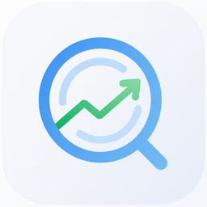

<p align="center">
  
</p>

<h1 align="center">Crypto Lens</h1>

<p align="center">
  一款轻量、免登录的 macOS 菜单栏加密资产与股票代币价格速览工具。
</p>

<p align="center">
  <strong>macOS 14+</strong> · <strong>SwiftUI</strong> · <strong>CoinMarketCap</strong> · <strong>Local-first</strong>
</p>

## 功能

- 从菜单栏快速查看关注资产的美元价格与 24 小时涨跌幅。
- 搜索 CoinMarketCap 收录的加密资产并加入本地关注列表。
- 识别应用内置目录中的股票代币，例如 xStocks 等链上证券代币。
- 支持关注列表增删、长按拖动排序和批量撤销删除。
- 打开面板时更新一次，保持打开期间不自动轮询；手动刷新有 60 秒冷却时间。
- 缓存最后一次成功行情，断网或请求失败时仍可查看历史价格。
- 无需账号和 API Key；也可配置个人 CoinMarketCap API Key 获得独立请求额度。

> 股票代币的搜索和价格仍来自 CoinMarketCap。应用内置目录只用于识别资产类型，不代表官方认证、证券推荐或投资背书。

## 本地安装

### 下载 Beta DMG

可以从 [GitHub Releases](https://github.com/YanYuanFE/crypto-lens/releases) 下载最新 Beta DMG。当前 Beta 没有 Apple Developer ID 签名或 Apple 公证，首次启动需要在“系统设置 → 隐私与安全性”中点击“仍要打开”。请勿关闭 Gatekeeper。

详细安装步骤与安全边界参见 [未公证 Beta 文档](docs/unnotarized-beta.md)。

### 环境要求

- macOS 14 Sonoma 或更高版本
- Xcode 及 macOS Command Line Tools
- Ruby（使用 macOS 自带版本即可）

无需 Apple Developer 账号，也无需 CoinMarketCap API Key。

### 构建并安装

```bash
git clone https://github.com/YanYuanFE/crypto-lens.git
cd crypto-lens
scripts/install_local_beta.sh
```

脚本会完成 Release 构建、仓库门禁、临时签名与签名校验，然后安装并启动：

```text
~/Applications/CryptoLens.app
```

再次运行同一命令即可覆盖升级。关注列表、行情缓存和钥匙串中的 API Key 会被保留。

仅构建而不安装：

```bash
scripts/build_local_beta.sh
```

生成的应用位于 `.build/local-beta/CryptoLens.app`。更多选项参见 [本地 Beta 文档](docs/local-beta.md)。

## CoinMarketCap API Key

Crypto Lens 默认调用 CoinMarketCap Keyless Public API，不配置 Key 也能搜索和刷新行情。

如需使用个人 Key：

1. 打开面板底部的设置。
2. 输入 CoinMarketCap API Key。
3. 点击“验证并保存”。

应用会先在线验证候选 Key，成功后才写入 macOS Keychain。Key 不会写入仓库、日志或 `UserDefaults`；首次读取后只在当前应用进程中缓存，退出应用即清空内存副本。

## 刷新策略

Crypto Lens 面向“打开看一眼”的低频场景：

| 场景 | 行为 |
| --- | --- |
| 打开面板 | 本地缓存立即展示，面板稳定可见 200ms 后更新一次 |
| 保持面板打开 | 不自动轮询 |
| 手动刷新 | 允许主动更新，成功后进入 60 秒冷却 |
| 关闭面板 | 取消搜索、刷新、重试和 UI 时间线任务 |
| 网络失败 | 保留并展示最后一次成功行情 |

## 开发

生成 Xcode 工程：

```bash
ruby scripts/generate_xcodeproj.rb
open CryptoLens.xcodeproj
```

从品牌母版重新生成全部 AppIcon 尺寸：

```bash
swift scripts/generate_app_icon.swift \
  docs/brand/app-icon-source.png \
  CryptoLens/Resources/Assets.xcassets/AppIcon.appiconset
```

运行测试：

```bash
xcodebuild test \
  -project CryptoLens.xcodeproj \
  -scheme CryptoLens \
  -destination 'platform=macOS' \
  -derivedDataPath .build/DerivedData \
  CODE_SIGNING_ALLOWED=NO \
  ONLY_ACTIVE_ARCH=YES
```

运行仓库门禁：

```bash
ruby scripts/verify_scope.rb
ruby scripts/verify_assets.rb
ruby scripts/verify_localizations.rb .build/DerivedData
```

项目不依赖第三方 Swift Package，运行时仅使用 Apple SDK Frameworks。

## 项目结构

```text
CryptoLens/
├── App/             # 应用入口与依赖装配
├── Data/            # Keychain、本地关注列表和行情缓存
├── Domain/          # 模型、协议、分类与业务用例
├── Network/         # CoinMarketCap 客户端与限流
├── Resources/       # 图标、本地化和股票代币目录
└── UI/              # SwiftUI 面板与状态模型

CryptoLensTests/     # 单元、网络、存储与界面快照测试
docs/                # 技术设计、ADR、审计和发布文档
scripts/             # 构建、安装和验证脚本
```

## 隐私与数据

- 无账号体系、遥测、广告或云同步。
- 关注列表与行情缓存只保存在本机 Application Support。
- 可选 API Key 保存在 macOS Keychain。
- 不连接钱包，不读取持仓，不提供交易功能。

## 分发状态

当前仓库提供的是源码和个人本地 Beta 构建流程。由于项目尚未使用 Developer ID 签名和 Apple 公证，不应把本地构建的 `.app` 当作面向公众的正式安装包分发。正式发布要求与检查项参见 [发布文档](docs/release.md)。

## 文档

- [技术设计](docs/design/macos-menu-bar-app.md)
- [实现审计](docs/implementation-audit.md)
- [股票代币分类 ADR](docs/adr/0001-curated-stock-token-classification.md)
- [本地 Beta](docs/local-beta.md)
- [未公证 Beta DMG](docs/unnotarized-beta.md)
- [正式发布流程](docs/release.md)

## 免责声明

Crypto Lens 仅用于展示公开市场信息，不构成投资建议。股票代币不是传统券商账户中的股票，其权利、价格、流动性和地区限制取决于具体发行方与交易场所。
