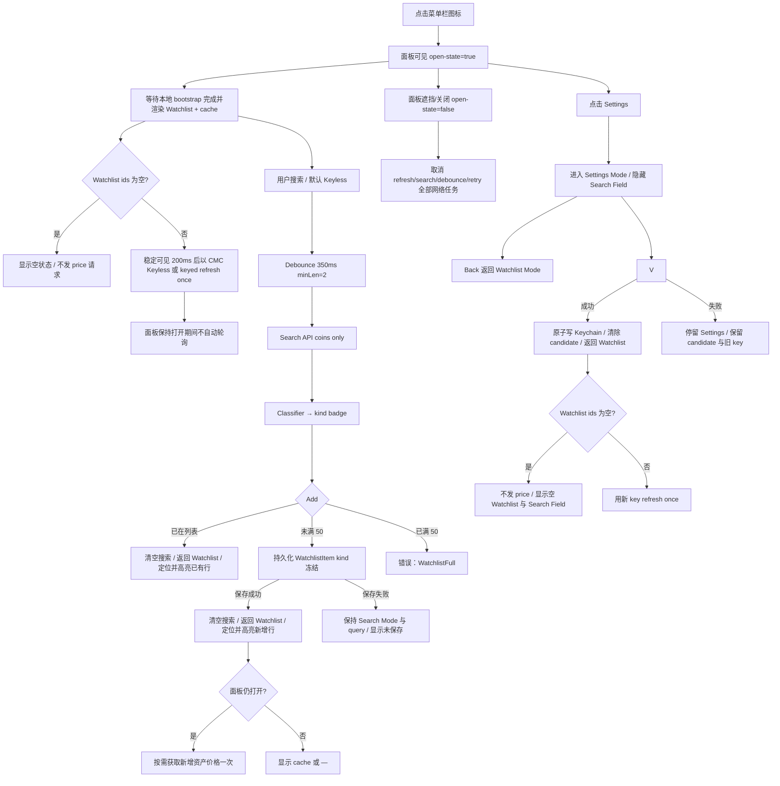
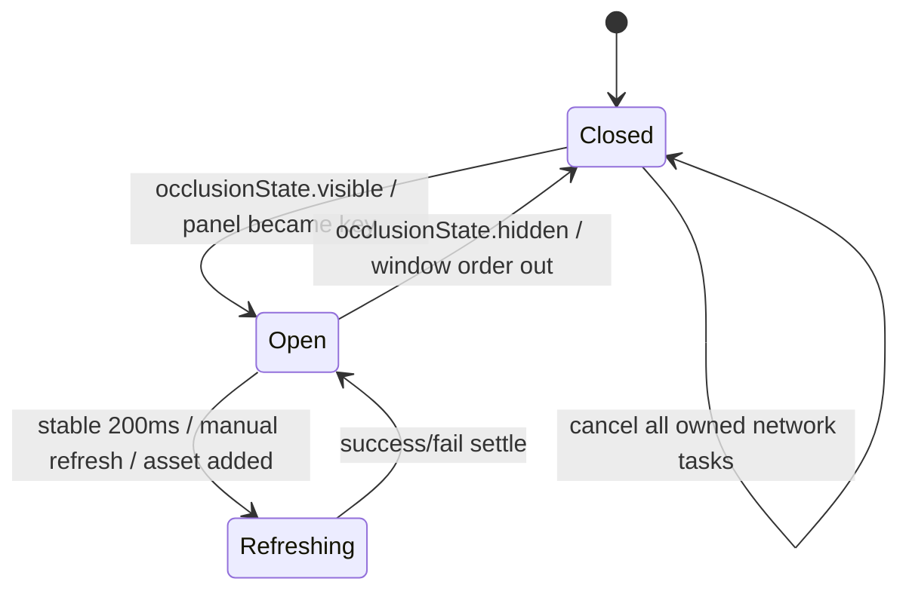
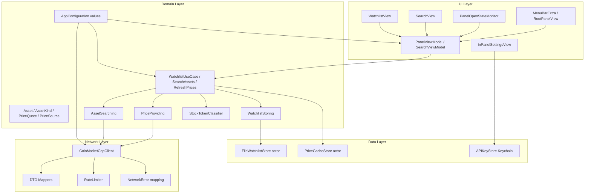
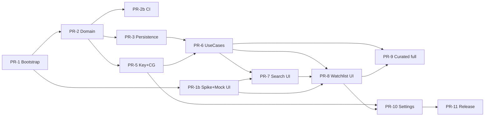

# Crypto Lens — macOS 菜单栏加密货币 / 股票代币价格速览应用

| 字段 | 内容 |
|------|------|
| **文档标题** | Crypto Lens macOS Menu Bar App — Technical Design |
| **作者** | Crypto Lens maintainers |
| **日期** | 2026-07-09 |
| **修订** | 2026-07-11（R58：API Key 进程内缓存） |
| **状态** | **Implemented / Release Evidence Pending** |
| **仓库** | `crypto-lens`（实现、测试与本地 Beta 工作流已落地） |
| **目标平台** | **macOS 14.0+（Sonoma）**；UI 以 SwiftUI `MenuBarExtra` 为主 |
| **交付范围** | 本文档为 **v1 技术设计**；不含实现代码 |

---

## Overview

Crypto Lens 是一款 **macOS 菜单栏（Status Bar）工具应用**：用户从菜单栏图标打开面板，快速搜索加密货币与 **股票代币（tokenized stocks / on-chain equities）**，将关心的资产加入本地 Watchlist，并在不打开完整窗口的情况下随时查看最新价格与 24h 涨跌。

应用采用 **Swift + SwiftUI** 分层架构，以 **CoinMarketCap Keyless Public API 为默认访问方式，可选 API Key 增强**（统一覆盖主流 crypto 与可被索引的 on-chain stock tokens），本地以 **Codable JSON 持久化 Watchlist**，无账号体系。应用以 **Accessory / LSUIElement** 方式运行，不占 Dock，聚焦「一眼价格」场景。

---

## Background & Motivation

### 当前状态

- 仓库 `/Users/yanyuan/Documents/Develop/Github/crypto-lens` 为 **Greenfield**：无既有应用代码、模块或依赖；设计文档为唯一 source of truth，直至 bootstrap PR。
- 产品名称暗示 **Lens（镜头 / 速览）**：核心价值是 **低摩擦、本地化的价格盯盘**，而非交易或投研终端。

### 痛点

| 痛点 | 说明 |
|------|------|
| 浏览器/交易所切换成本高 | 只想确认 BTC 或某只代币化股票现价时，打开网页过重 |
| 数据源碎片化 | 普通币种与股票代币（xStocks、Ondo 等）往往分属不同产品心智，用户需要统一入口 |
| 网络不稳定时不可用 | 纯在线页面无本地缓存，断网或限流时无法看到「最后一次已知价」 |
| 隐私与账号负担 | 多数工具要求登录；本地小工具不应强制账户 |

### 机会

- macOS `MenuBarExtra` 已成熟，可用 SwiftUI 快速交付菜单栏 + 弹出面板。
- 股票代币（tokenized equities）在 2025–2026 已形成可检索的 on-chain 资产类目（如 Backed xStocks、Ondo Global Markets 等），多数可在 CoinGecko 等加密行情 API 中按 token / contract 检索，**无需 v1 接入传统券商股票行情**。

---

## Goals & Non-Goals

### Goals（v1）

1. **菜单栏常驻**：状态栏 **icon-only** 图标 + 弹出面板，无 Dock 图标（`LSUIElement`）。
2. **快捷搜索**：输入 debounced 搜索（min length 2），展示 symbol / name；Stock Token 额外显示 kind badge；支持选择加入 Watchlist。
3. **本地 Watchlist**：增删、Watchlist Reorder（拖拽、菜单）、冷启动恢复、重复添加策略、软上限 50。
4. **价格展示**：现价、相对计价货币（默认 USD）、24h 涨跌幅、本地 `fetchedAt` 与 provider `lastUpdatedAt`（若可得）。
5. **资产类型**：统一 `Asset` 模型，`kind ∈ { crypto, stockToken }`；**kind 徽章以 curated 列表为准**。
6. **刷新策略**：面板稳定可见 **200ms** 后刷新一次；面板保持打开期间不自动轮询；手动刷新有 cooldown；展示 last-known 缓存。
7. **离线可读可编辑**：无网时显示上次成功价格并标注 stale；Watchlist 增删排序可用；仅当前会话已加载的搜索结果可离线 Add（无价显示 `—`）。
8. **免 Key 即用**：未配置凭据时使用 CoinMarketCap `/public-api`；用户可选输入 CMC API Key，candidate 必须先验证成功才写入 Keychain。

### Non-Goals（v1 明确不做）

| 项 | 说明 |
|----|------|
| 交易 / 下单 / 钱包连接 | 非交易终端 |
| 组合 PnL / 持仓成本 | 无数量与成本字段 |
| 传统证券（券商股票）行情 | v1 的「股票代币」= **链上代币化股票/ETF**，不是 Yahoo Finance 式 US 股票 |
| 推送通知 / 价格预警 | 当前规划明确不做；未来必须作为后台刷新与通知子系统独立设计 |
| 多设备同步 / iCloud | 当前规划保持 local-only；无 CloudKit/iCloud entitlement、同步协议或跨设备 merge |
| 账号体系、社交、图表 K 线深度 | 超出 Lens 定位 |
| Windows / iOS / Web | 仅 macOS |
| 后台刷新 / 面板保持打开期间自动轮询 | v1 仅打开时刷新 + 手动刷新，遵守 macOS 生命周期与 API rate limit |
| Launch at Login | v1 明确 **out of scope**；post-v1 候选，届时以 `SMAppService.mainApp` 独立设计 |
| 第二运行时行情源 | v1 不再并行请求 CoinGecko 或自动切换第三方 provider |
| 自定义键盘增强与焦点编排 | v1 仅保证系统 `Tab / Shift-Tab` 导航和 mode-aware `Esc`；`Delete`、`⌥↑/⌥↓`、自动聚焦与精确 focus restore 延后 |
| 自动更新 / 后台更新检查 | v1 不集成 Sparkle 或自研 updater，不维护 update feed/签名密钥；用户手动下载安装新版本 |
| 多计价货币 / 汇率换算 | v1 固定 USD，Settings 无 currency selector；CNY 等后续版本再评估 |
| 菜单栏短价 / 主资产 | v1 与当前 v1.1 规划均保持 icon-only；未来需连同主资产偏好和后台更新独立设计 |
| 第三方 Swift Package | v1 运行时与测试均不引入；只使用 Apple SDK frameworks + XCTest/URLProtocol |

---

## Implementation Defaults（Open 问题未确认前的工程默认）

以下 defaults 已在产品讨论中收敛，**实现不得由各 PR 自行改变**：

| 决策点 | v1 实现默认 | 后续可改 |
|--------|-------------|----------|
| 数据源档位 | **CoinMarketCap Keyless 默认；可选 API Key**；Keyless 增加 `/public-api` path，keyed 请求发送 `X-CMC_PRO_API_KEY` | 付费 plan 能力需后续独立设计 |
| 计价货币 | **仅 USD** | 可扩展 `vs_currencies` |
| UI locale | **仅简体中文（zh-Hans）**；所有 user-facing strings 使用 `Localizable.xcstrings` | 英文/双语后续版本再加 |
| v1 分发 | **Developer ID + Hardened Runtime + Notarization**；ZIP/DMG；App Sandbox disabled | 后续 Mac App Store build 再启用 sandbox entitlements |
| 股票代币目录 | **必须** 随包 Curated Stock Token Catalog；近完整覆盖已验证的 Backed xStocks + Ondo Global Markets CoinGecko IDs；≥20 仅 CI floor | 后续增加发行方需独立验证 |
| 菜单栏 | **icon-only** + accessibility label `Crypto Lens` | 当前规划不显示资产 symbol/price title |
| 品牌图标 | status item 使用 SF Symbol template；bundle 使用自定义 AppIcon | 后续可替换视觉，不改交互 |
| 打开面板刷新 | 稳定可见 **200ms** 后刷新一次；不自动轮询；手动刷新 cooldown **60s** | 自动轮询不在当前规划 |
| 冷启动网络 | **面板首次打开前不发网络请求**；首次刷新必须等待本地 bootstrap 完成且 ids 非空 | — |
| API Key 来源 | **可选**：用户在 Settings 输入 candidate → 服务端验证成功 → Keychain；Debug 可用 env `COINMARKETCAP_API_KEY` 注入 | 禁止把 key 打进 release 二进制 |
| 首次可用 | 无 onboarding gate；bootstrap 后进入 Watchlist，搜索与联网均可直接使用 Keyless | — |
| Deployment target | **macOS 14.0**；v1 禁止无 availability fallback 的 macOS 15-only API | 后续 major version 再评估抬高 |

---

## 产品范围（Product Scope）

### 信息架构

```text
Menu Bar Icon (icon-only, SF Symbol template)
 └─ Popover Panel (fixed 360 × 480pt, non-resizable)
     ├─ Mode-aware Fixed Header
     │    ├─ Watchlist: 标题 + 更新时间 / 刷新状态 + Refresh
     │    ├─ Search: 标题（无价格 Refresh）
     │    └─ Settings: Back + 设置
     ├─ Status Banner Slot（最多一个全局状态）
     ├─ Panel Body（三种 mode 互斥）
     │    ├─ Watchlist Mode（默认）
     │    │    ├─ Fixed Search Field
     │    │    └─ Main Scroll: 56pt two-line Watchlist rows + Removal / Reorder
     │    ├─ Search Mode（trimmed query ≥2）
     │    │    ├─ Fixed Search Field
     │    │    └─ Main Scroll: 52pt Search Result rows（仅 coins；临时，不持久）
     │    └─ Settings Mode
     │         ├─ Search Field hidden
     │         └─ Main Scroll: 可选 CoinMarketCap API Key · 刷新说明 · About（version/build）
     └─ Mode-aware Fixed Footer
          ├─ Watchlist / Search: Gear icon · attribution link · Power icon
          └─ Settings: empty leading slot · attribution link · Power icon
```

### 设置与退出（v1 冻结）

| 项 | 决策 |
|----|------|
| Settings UI | 独立 **Settings Mode**（API Key、刷新策略只读说明、About），在同一 panel 内替换 Search Field 与 Main Content；Header 提供 Back；**不**使用折叠区 |
| 计价货币 | Settings 只读显示「计价货币：USD」，无 selector；API `vs_currencies=usd`，UI 使用 USD formatter |
| 首次可用性 | bootstrap 后直接进入 Watchlist；无 Key 也是完整可用状态，Settings 只提供可选 CoinMarketCap API Key |
| 系统 Settings scene | **不创建**；无第二设置窗口，`⌘,` 不作为 v1 支持路径 |
| Quit | Footer Power 无确认；取消网络并等待本地保存最多 2s 后 `NSApplication.shared.terminate(nil)` |
| 移除 API Key | Settings 提供次要 destructive action；原生确认后只删除 Keychain credential，不删除 Watchlist/cache |
| Launch at Login | **不做** |
| 激活策略 | 保持 agent（`LSUIElement`）；打开面板不切换为 regular app；不因进入 Settings Mode 改 Dock 行为 |

### 核心用户流程



### UX 要点

- **搜索 debounce**：`350ms`；`query.trimming` 后 **长度 &lt; 2 不发请求**（清空结果）。
- **Search state machine**：`idle`（trimmed length 0–1）→ `debouncing(query)` → `loading(query)` → `results(query, items) | empty(query) | failure(query, error)`。只有 idle 返回 Watchlist Mode；其余状态均属于 Search Mode。
- **query 改变**：normalized query 与当前 state query 不同即取消 debounce/request、立即清空旧 items 并进入新的 `debouncing`；不在新 query 下继续展示旧 results。debouncing 使用轻量占位，请求实际发出后才显示 loading indicator。
- **响应身份**：每次有效 query 分配 generation/token；response 只有在 token 与当前 query/state 一致时才能提交。取消后迟到的 response、旧 query response 与 panel close 后 response 一律丢弃，不更新 results/error。
- **Search failure presentation**：保留当前 query 与 Search Mode，Main Scroll 显示紧凑本地错误态「无法完成搜索」及 action；Status Banner 同时按 selector 显示底层全局原因。`empty(query)` 只显示「未找到相关资产」，不创建 error condition 或 banner。
- **Search retry**：offline / timeout / 5xx 的 action 为「重试」，立即对当前 normalized query 发新 generation，不再等待 350ms debounce，仍经过全局 RateLimiter；search 不自动 retry。429 时 Retry disabled 到 `nextAllowedRequestAt`，由 banner 显示剩余时间；已配置 CMC Key 返回 401 时标记该 key 无效并进入 Settings，后续用户动作自动改用 Keyless。
- **Search success**：提交 results/empty 时解除与该 search 相关的 `offline / timeout / serverError / refreshFailed` condition；不得解除仍由其他独立操作维持的 persistence/key/rate-limit condition。
- **互斥面板模式**：面板任一时刻只处于 **Watchlist Mode**、**Search Mode**、**Settings Mode** 之一。trimmed query 长度达到 2 时进入 Search Mode，其 loading / results / empty / error 状态替换 Watchlist 主滚动区；不使用 overlay、上下堆叠或嵌套滚动。长度回到 0–1 时清空结果并返回 Watchlist Mode。
- **Settings Mode**：点击 Footer Settings 后取消 search task、清空 query 并进入 Settings Mode；Search Field 隐藏，Header 显示 Back +「设置」，Main Scroll 展示 API Key、刷新说明与 About。Back 返回 Watchlist Mode，不恢复进入设置前的 Search Mode/query。
- **API Key commit boundary**：输入框内容只是 candidate，不得先写入 Keychain。点击「验证并保存」后，使用 candidate 发起认证校验；只有 2xx 且响应结构有效时才原子替换 Keychain 中的旧值，成为 Configured API Key。验证失败不得覆盖已有 Configured API Key。
- **验证请求**：v1 使用最小 `/simple/price?ids=bitcoin&vs_currencies=usd` 请求验证认证和可解码响应；该响应不写入 Watchlist price cache，但计入 1 call credit，并受全局 RateLimiter / 429 gate 约束。
- **Candidate 生命周期**：candidate 只保存在当前 app process 的 Settings 状态中，不写 UserDefaults、文件或 Keychain。关闭 panel 或取消验证时保留输入但不自动重试；退出 app 时丢弃。用户显式清空或验证成功后也清除 candidate。
- **验证失败**：401 显示「API Key 无效」；429 显示限流和可重试时间；offline / timeout / 5xx / decoding 显示「暂时无法验证」。所有失败均停留 Settings Mode、保留 candidate、保持旧 Configured API Key 不变，且不创建自动重试任务。
- **验证成功**：原子写入 Keychain 后清除 candidate 与 validation error，自动返回 Watchlist Mode。Watchlist 非空时立即以新 key 刷新一次；为空时不发 price 请求并显示可用 Search Field。替换旧 key 也执行同一路径。
- **成功后刷新例外**：`refreshNow(reason: .keyConfigured)` 属于用户配置动作，不受 manual cooldown 限制，但受单一 in-flight price、全局 RateLimiter、429 gate 与 panel-open 约束。
- **移除 Configured API Key**：Settings 中显示次要 destructive action「移除 API Key」；点击后使用原生确认。确认后先取消 validation/search/price/retry tasks，再删除 Keychain 值；成功后清 candidate、authorization error、rate-limit gate 与 manual cooldown，但保留 Watchlist、Last-Known Quotes 和 bulk metadata。
- **移除结果**：Keychain delete 成功后停留 Settings Mode，并立即恢复 Keyless 可用状态，不显示缺 Key banner。Keychain delete 失败则旧 key 仍为 Configured API Key，显示 Settings 本地错误并允许重试，不清除 cache 或授权状态。
- **Configured Key presentation**：不把现有 key 回填输入框，不显示完整值，不提供 copy。Settings 只显示「已配置 · ••••A1B2」式末四位状态与「移除 API Key」；末四位按需从 Keychain-loaded value 在内存计算，不单独持久化或记录日志。
- **Candidate input privacy**：替换/首次配置使用空 `SecureField`。Reveal control 只切换当前 Candidate API Key 的可见性；离开 Settings、关闭 panel 或 app 失去活动状态时强制恢复 masked，但 candidate 仍按进程内生命周期保留。无 clipboard/copy action，accessibility 只读「API Key 已配置」，不朗读尾号或完整 secret。
- **Keyless 默认态**：不配置 CMC Key 不属于异常或 onboarding 状态；Watchlist、搜索、打开时刷新与手动刷新保持可用，不创建缺 Key banner。
- **Configured Key 失效**：使用已保存 CMC Key 的请求若返回 401，本次操作失败且不自动重试；client 在本进程禁用该 key，显示无效状态，下一次用户动作使用 `/public-api`。重新验证保存或移除 key 会重置该内存状态。
- **Status Banner**：Header 下方只有一个全局 banner slot；状态模型可同时保留多个 active conditions，但 selector 只显示最高优先级项。slot 指固定位置而非永久占高；无状态时不保留空白。banner 最多两行，并可带一个明确 action。
- **全局优先级**：`persistenceFailure / corruptedStore / classificationUnavailable` > `configuredKeyInvalid` > `rateLimited` > `offline / timeout / serverError` > `refreshFailed`。高优先级消失后重新选择并显示仍 active 的下一项，不丢弃被遮挡状态。
- **不进入 Status Banner**：Candidate API Key 验证错误显示在 Settings 输入框下方；Stale Quote 只使用 row clock 与 Header 更新时间；Removal Batch Undo 使用 Footer 上方独立 action bar；成功提示使用 VoiceOver announcement / transient highlight，不占 banner。
- **Banner dismissal**：除 `corruptedStore` 恢复事件与 `classificationUnavailable` 一次性通知外不显示关闭按钮，banner 必须由对应 condition 的 resolve event 自动解除，用户不能把仍存在的问题手动隐藏。
- **Resolve 规则**：`persistenceFailure` 在下一次 Watchlist/cache save 成功后解除；`configuredKeyInvalid` 在新 key 验证并 commit 成功或移除 key 后解除；`rateLimited` 在 `nextAllowedRequestAt` 到期后解除；`offline / timeout / serverError / refreshFailed` 在下一次相关网络请求成功后解除。新失败可替换同类 condition 的详情和时间。
- **一次性恢复事件**：`corruptedStore` 显示「列表已重置」及确认按钮，用户确认后解除；每次实际 corrupt-file recovery 最多创建一个事件，不跨 app restart 重复播报已确认事件。
- **分类资源事件**：`classificationUnavailable` 显示一次「资产分类数据不可用」及确认按钮；确认后本进程不重复显示。搜索、价格与 Watchlist 保持可用，Stock Token badge 暂停；下次 app launch 重新尝试加载资源。
- **固定区域**：Header 与 Footer 固定但内容随 mode 改变；Search Field 仅在 Watchlist/Search Mode 固定显示；每种 mode 只有一个 Main Scroll。
- **Panel 外框**：v1 固定 **360 × 480pt**，用户不可 resize；Watchlist/Search/Settings、Status Banner 与 Removal Undo 的出现都不得改变窗口尺寸，只调整 Main Scroll 的可用高度。320pt / 380pt 仅用于布局压力测试，不是生产可选尺寸。
- **Footer contract**：固定高度、左右使用等宽 icon slots。Watchlist/Search 左侧 `gearshape` 进入 Settings，右侧 `power` 退出；中间为可点击 attribution link。Settings Mode 隐藏 gear 但保留 leading slot 占位，确保 attribution 不水平跳动。
- **Footer labels**：icon-only commands 必须提供 tooltip 与 accessibility label「设置」「退出 Crypto Lens」。attribution 显示 `Data by CoinMarketCap` 并打开官方站点；最终措辞仍受 Release Owner 条款审核约束。
- **本地化契约**：v1 只发布 `zh-Hans`。View、ViewModel error mapping、tooltip、accessibility label/help、confirmation、Status Banner、empty/loading states 不得硬编码用户可见字符串，统一进入 `Localizable.xcstrings`；Removal Batch 数量等使用 plural variation。品牌名、ticker、provider attribution 按官方拼写保留。
- **About 产品边界**：固定展示「仅供信息，不构成投资建议。股票代币不是传统股票，其结构、权利、价格及可用地区取决于发行方，价格可能偏离标的资产。Crypto Lens 不提供交易服务。」文案来自 String Catalog，不使用首次启动弹窗。
- **发行方外链**：About 提供 Backed xStocks 与 Ondo Stocks 的官方产品/法律链接；只链接 HTTPS primary sources。打开外部浏览器可能关闭 panel，必须执行统一 close path。
- **Undo placement**：Removal Batch action bar 位于 Footer 上方的独立固定层，不覆盖 gear/attribution/power。attribution 打开外部浏览器导致 panel close 时，执行统一 close path 并 finalize active Removal Batch。
- **Graceful shutdown**：Power 点击后立即进入 `isShuttingDown`，禁用全部 commands，取消 network/debounce/retry/timeline，finalize Removal Batch 并丢弃 Candidate API Key；等待当前 Watchlist/cache/Keychain 本地 mutation settle，最长 **2 秒**，随后调用 terminate，不弹确认。
- **Shutdown failure**：本地 save/delete 失败或 2 秒超时只写 `os.Logger.fault`，不阻止用户退出。atomic replace 保证旧文件或新文件二选一，不留下半截 JSON；尚未完成的最后一次 mutation 允许在极端情况下丢失。
- **`Esc` 单层返回**：Search Mode 下清空 query、取消 search debounce/request 并回 Watchlist；Settings Mode 下取消 candidate key validation、保留进程内 candidate 并回 Watchlist，不取消 price refresh；Watchlist Mode 下关闭 panel。
- **统一 close path**：Watchlist Mode 的 `Esc` 与点击菜单栏图标关闭走同一 `onClose`：取消全部 owned network tasks 与 stale timeline、finalize Removal Batch、清除 transient highlight。Search/Settings 的第一次 `Esc` 不关闭 panel。
- **v1 键盘基线**：只承诺系统原生 `Tab / Shift-Tab` 可到达所有交互控件，以及上述 mode-aware `Esc`。不实现自动聚焦、Add 后 focus restore、`Delete` removal、`⌥↑/⌥↓` reorder 或其他自定义快捷键；这些不作为 v1 验收条件。
- **资产发现**：首次搜索读取 CMC `/v1/cryptocurrency/map?limit=5000&sort=cmc_rank&aux=platform` 并做进程内缓存；本地按 name/symbol/slug 包含匹配。无本地结果且 query 适合作为 symbol 时，用 `symbol` 参数做一次精确补查并并入缓存。
- **结果排序**：保留 CMC rank 顺序为基底；**symbol 精确匹配**（大小写不敏感）置顶；同 symbol 再按 `marketCapRank` 升序（nil 最后）。
- **结果上限**：展示最多 **20** 条。
- **Search Result row**：固定约 **52pt** 双行。leading 为 28pt thumb slot；identity 第一行 `symbol + kind badge`，第二行 `name · #marketCapRank`（rank nil 时省略）；trailing 为固定尺寸 icon-only action。长文本单行尾部截断，320 / 360 / 380pt 下不得与 action 重叠。
- **Search Result action**：未加入 Watchlist 显示 `+`，tooltip/accessibility label「添加到关注列表」；已存在显示 `✓`，label「已在关注列表，查看」，点击后仍执行 duplicate Add completion：清 query、回 Watchlist、定位并高亮已有行。按钮状态必须由当前 Watchlist snapshot 派生。
- **搜索不取价**：Search Result 不展示 price/change，Search Mode 不因渲染 results 调用 `/simple/price`；只有成功 Add 后按既有 `assetAdded` 路径获取新增 id 价格。
- **Watchlist 软上限**：**50**；超额拒绝并提示精简。
- **Watchlist 满额 UI**：snapshot count == 50 时，未在 Watchlist 的 Search Results 保持可见，但 `+` disabled，tooltip/accessibility help「关注列表最多 50 项」；已存在结果的 `✓` 仍可点击并按 duplicate completion 定位。
- **满额竞态兜底**：UI disabled 不是 Domain invariant；若 add command 因 snapshot 变化返回 `watchlistFull`，保留 Search Mode/query/results，并显示本地「关注列表已满」提示，不创建全局 Status Banner。任意成功 removal 后由新 snapshot 自动恢复 `+`。
- **Watchlist Removal**：不弹确认框；hover/focus 删除按钮与 context menu「移除」统一调用同一 command。保存成功后立即从列表移除，并在 Footer 上方显示 **5 秒** Undo 操作条。
- **Removal Batch**：第一项成功 removal 创建 batch；滚动 5 秒窗口内的后续成功 removal 加入同一 batch 并重置计时。操作条按数量显示「已移除 1 项 · 撤销」或「已移除 N 项 · 撤销」。
- **批量撤销边界**：Undo 一次恢复 batch 全部 items 及其原相对顺序，并再次保存完整 snapshot；超时、关闭 panel 或退出 app 会清除 batch，removals 保持生效。首次 removal save 失败则只回滚该项且不加入 batch；Undo save 失败则整批保持 removed 并显示「无法撤销」。
- **批量撤销状态**：每个 entry 至少保存 removed item、移除时 index、移除顺序与可选 in-memory quote；恢复时按移除顺序逆序插回并统一重建 `sortOrder`。removal 后立即从持久化 price cache prune；Undo 成功后恢复 quotes 并重新持久化，避免行短暂显示 `—`。
- **与其他 mutation 交错**：Add 固定追加到 Watchlist 末尾，可在 Removal Batch 存活期间执行且不终止 batch；开始 reorder 前必须先 finalize batch、清除 Undo bar，再对当前 snapshot 排序。后续 removal 继续加入仍存活的 batch。
- **Watchlist Reorder**：row 在 hover 或 keyboard focus 时显示拖拽 handle；仅从 handle 开始 drag，drop 成功后调用一次 reorder command 并保存一次，取消 drag 不改变 snapshot。无需进入 edit mode，不常驻显示上下按钮。
- **替代入口**：row context menu 提供「上移」「下移」；VoiceOver 暴露同名 accessibility actions。首项「上移」与末项「下移」disabled，所有入口每次移动一格并复用同一 command；v1 不提供 reorder 键盘快捷键。
- **Reorder 失败**：UI 可在 drag 期间预览位置，但持久化失败必须回滚到 `lastPersistedSnapshot` 并显示「更改未保存」。
- **Watchlist row contract**：固定高度约 **56pt**、双行、整行宽度稳定。leading 顺序为 reserved drag-handle slot → 28pt thumb → flexible identity column；trailing 为 92–112pt quote column → reserved remove slot。handle/remove 仅改变 opacity 与 hit-testing，不在 hover/focus 时插入或移除布局节点。
- **Identity column**：第一行 `symbol + kind badge`，第二行 secondary-color `name`；两行均单行显示，超长尾部截断，identity column 允许收缩但不得把 quote column 推出 panel。
- **Kind badge policy**：仅 `AssetKind.stockToken` 显示文字徽章「股票代币」；`crypto` 不显示徽章。徽章使用低饱和中性色，不使用涨跌红/绿，且不得仅靠颜色表达 kind；tooltip/accessibility label 同样读作「股票代币」。Search Result 使用实时 classifier kind，Watchlist row 使用 Add 时冻结的 kind。
- **Quote column**：第一行右对齐 price，第二行右对齐带显式 `+` / `−` 的 24h change；使用 tabular/monospaced digits 防止刷新时水平跳动。涨跌颜色只是辅助信息，VoiceOver label 必须读出方向和百分比。
- **stale row**：price 旁显示小型 clock icon，tooltip / accessibility help 说明最后更新时间；row 内不常驻展示 `fetchedAt` 或 provider timestamp 文本。无 quote 时 price 显示 `—`，change 留空但保持列尺寸。
- **响应式验收**：生产宽度 360pt 必须无水平滚动、重叠或 hover/focus 位移；另在 320 / 380pt 压力测试。优先截断 name，其次限制 symbol/badge 组合，price 与 change 不截断关键数字或正负号。
- **重复添加**：同一 `AssetID` 已存在 → **不新增**，UI 滚动定位/高亮已有行，并通过 VoiceOver announcement 表达「已在列表中」；不额外显示 toast。
- **Add completion**：持久化成功后清空 query、取消残余 search task、返回 Watchlist Mode、滚动到目标行并短暂高亮；重复 Add 使用相同返回与定位行为。持久化失败则保持 Search Mode、query、结果与选择位置不变，并显示「更改未保存」，便于重试。
- **高亮语义**：目标行使用非阻塞 transient highlight，建议 1.2s 后淡出；不得依赖颜色传达成功，VoiceOver 同时播报「已添加」或「已在列表中」。
- **离线 Add 边界**：仅允许添加当前会话中已经成功加载、仍显示在 UI 的搜索结果；v1 不提供完整本地资产目录，因此不承诺离线发现新资产。价格为 `—`，不排队网络；恢复网络后由下一次打开或手动刷新补齐。
- **在线 Add 后取价**：持久化成功后，对新增 `AssetID` 发起一次按需 price 请求；若已有 price 请求 in-flight，则合并到 pending ids，当前请求结束后仅补一次。该用户动作不受 manual cooldown 限制，但仍受全局 RateLimiter、429 gate 与 panel-open 约束。
- **USD 价格格式**：`price ≥ 1` 固定 2 位小数并使用千位分隔（`$1,234.56`）；`0.01 ≤ price < 1` 最多 4 位小数；`0.000001 ≤ price < 0.01` 最多 6 位小数；后两档去掉尾随零；`price < 0.000001` 使用 3 位有效数字科学计数法（如 `$1.23e−7`），不得显示成 `$0.00`。
- **24h change 格式**：非 nil 值固定 2 位小数并始终显示方向符号，如 `+2.14%` / `−0.32%`；nil 留空，不显示 `0.00%`。
- **格式化单一来源**：Watchlist row、tooltip、accessibility 共用同一 formatter policy。row 使用上述紧凑值；tooltip 提供未截断的原始 Decimal 字符串；VoiceOver 读完整值、货币名称「美元」与涨跌方向，不朗读科学计数法符号串。
- **Stale Quote**：距本地 `fetchedAt` **&gt; 5 分钟**时仍显示 last-known price，但使用 stale clock、tooltip 与 accessibility help 标记可能过时；provider `lastUpdatedAt` 仅作为补充信息，不替代本地阈值判断。
- **本地 stale timeline**：panel open 时每 **30 秒**仅用当前时间重算相对时间与 stale presentation；不调用任何 repository/client，不触发 price refresh，不消耗 credits。panel close 时停止；从 Settings Mode 返回 Watchlist 时立即重算一次。
- **cache-first 渲染**：bootstrap 完成后立即显示所有 Last-Known Quotes；open/manual/keyConfigured refresh 期间不得清空 price/change、替换为 skeleton 或遮挡 Watchlist。Header Refresh 显示 progress；无 Last-Known Quote 的 row 保持 `—`。
- **quote commit**：一次 bulk response 解码完成后，在单次 UI state commit 中替换成功返回 ids 的 quotes；soft-miss ids 保留旧值。随后保存一次 price cache。请求失败或 cache save 失败均不得丢弃当前内存中的 Last-Known Quotes。
- **bootstrap placeholder**：仅本地 watchlist/cache 尚未读取完成时显示固定尺寸的短暂 loading placeholder，不伪造 row/price；load ready 后切到真实空态或 cache-first Watchlist。
- **空 Watchlist**：Watchlist 为空时，Main Scroll 显示居中 SF Symbol +「暂无关注资产」；不使用 card、不添加说明段落或额外 CTA，固定 Search Field 保持可用。若由最后一项 removal 产生，Removal Batch Undo bar 继续显示并可恢复内容。
- **Header freshness**：无任何 quote/bulk metadata 时显示「尚未更新」；price in-flight 时显示「正在更新…」；最近一次 bulk 覆盖当前全部 ids 且无 soft-miss 时显示相对时间（刚刚 / N 分钟前更新）；否则显示「部分更新 · 相对时间」。请求失败不覆盖上次成功时间，原因只进入 Status Banner。
- **Header 时间来源**：使用持久化 `lastBulkRefreshAt`，由 30 秒本地 timeline 更新相对文案；provider `lastUpdatedAt` 只出现在 row tooltip。Add 后单 id price 不更新 bulk metadata，因此不能把局部成功显示成整表刚刚更新。
- **手动 Refresh 可见性**：仅 Watchlist Mode Header 显示 icon-only price refresh；Search Mode 不显示，避免与 search retry 混淆；Settings Mode Header 仅 Back + 标题。
- **手动 Refresh 状态**：任意 price request in-flight 时显示 progress 并 disabled；manual cooldown 内 disabled，tooltip 显示剩余秒数；Watchlist 为空时 disabled +「暂无关注资产」。无 Key 或已知无效 Key 不禁用按钮，后续请求使用 Keyless。所有状态由 RefreshCoordinator 单一投影。
- **Manual cooldown 起算**：仅成功的 Watchlist bulk price response 更新进程内 `lastSuccessfulWatchlistBulkAt` 并开始 60 秒，包括 open/manual/keyConfigured refresh；200 soft-miss 仍算成功。失败 response、Candidate Key 验证与 Add 后单 id price 不启动或重置 cooldown。
- **Cooldown 作用域**：只限制 manual trigger，不阻止下一次 panel open refresh 或 keyConfigured refresh；不持久化，app restart 后为空。与 429 gate 同时存在时按钮按更晚的 `nextManualRefreshAt` / `nextAllowedRequestAt` disabled。
- **Thumb slot**：Watchlist/Search rows 均固定保留 28pt slot。CMC 数字 ID 按官方 metadata 返回的 `https://s2.coinmarketcap.com/static/img/coins/64x64/{id}.png` 规则生成 logo URL；旧 provider ID 在报价映射后由 `PriceQuote.logoURL` 带回 CMC logo。URL 仅允许 HTTPS，缺失或加载失败时静默显示 SF Symbol 占位。**v1 不落盘图片缓存**（内存 `URLSession` 默认缓存即可）；失败不改变 row 布局，不影响 Add/价格。
- **菜单栏**：**icon-only**（见下）；当前规划不显示 symbol/price title，也不引入 primary-asset preference。

---

## 关键术语：股票代币（Stock Token）

本产品中的 **股票代币** 指：

> 由合规发行方将美股/ETF 等底层证券 1:1 或按规则铸造到公链上的 **可交易 crypto token**（如 Backed **xStocks**、Ondo Global Markets 的 tokenized equities 等），可在 DEX/CEX 以 crypto 方式报价。

**不是**：传统券商 AAPL/TSLA、CFD（除非已作为独立 crypto 被行情 API 收录）。

**实现含义（v1 冻结）**：

- 新资产价格走 **CoinMarketCap**（`AssetID` = 数字 CMC ID）。R55 及更早版本保存的 CoinGecko slug 先由 CMC `/map` 按 slug 做运行时兼容映射，未命中时再用旧 Asset symbol 精确补查；仍无法映射则保留 last-known quote 并按 soft-miss 处理。
- **徽章准确性依赖随包 curated 列表**，不以 search 的 categories 字段为准（search **不返回** categories；按结果拉 detail/category 会造成 N+1，**禁止** 作为默认路径）。
- `kind` 在 **加入 Watchlist 时冻结** 写入 `WatchlistItem.asset.kind`；启动时 **不** 自动重算历史项（避免列表跳动）。当前规划不提供 Settings 手动重分类；classifier 只用于新 Search Results，删除后重加才采用新 catalog kind。

---

## Proposed Design

### 技术栈推荐

| 层 | 选择 | 理由 |
|----|------|------|
| 语言 / UI | **Swift 5.10+ / SwiftUI** | 原生、与 `MenuBarExtra` 一体 |
| 最低系统 | **macOS 14.0+** | `MenuBarExtra` 稳定 |
| 菜单栏 | **SwiftUI `MenuBarExtra`（`.window`）** | 富面板；open-state 需 occlusion 加固（见下） |
| 网络 | **URLSession + async/await** | Keyless 使用 `/public-api` 且无认证 header；keyed 请求注入 CMC Header |
| 持久化 | **Application Support Codable JSON** + **Keychain** | v1 无 UserDefaults 偏好 |
| 并发 | **Swift Concurrency；store 用 `actor`** | 防 load/save 竞态 |
| 依赖 | **Zero third-party dependencies** | 无 SPM runtime/test package、无 `Package.resolved` |
| 打包 | macOS App；`LSUIElement = YES`；Developer ID + Hardened Runtime + Notarization；ZIP/DMG | v1 不上 Mac App Store |

### MenuBarExtra vs NSStatusItem

| 维度 | `MenuBarExtra` (SwiftUI) | `NSStatusItem` (AppKit) |
|------|--------------------------|-------------------------|
| 实现成本 | 低 | 中高 |
| 富面板 | `.window` 可承载 SwiftUI | 需 `NSPopover` |
| open/close 信号 | **不可默认信任** `onAppear`/`onDisappear` | 窗口/popover 委托更可控 |
| **v1 结论** | **采用 `MenuBarExtra` + `.window` + 显式 open-state 观测** | 仅当 spike 失败再 hybrid |

### 菜单栏入口（icon-only）

```swift
@main
struct CryptoLensApp: App {
    @StateObject private var env = AppEnvironment.bootstrap()

    var body: some Scene {
        MenuBarExtra {
            RootPanelView()
                .environmentObject(env)
                .frame(width: 360, height: 480)
        } label: {
            // v1: icon-only；勿用会显示文字的 title 重载
            Label("Crypto Lens", systemImage: "chart.line.uptrend.xyaxis")
                .labelStyle(.iconOnly)
                .accessibilityLabel("Crypto Lens")
        }
        .menuBarExtraStyle(.window)
    }
}
```

`Info.plist`：`LSUIElement` = `true`；`CFBundleDisplayName` = `Crypto Lens`。

**图标资产规范**：

- status item 使用 SF Symbol `chart.line.uptrend.xyaxis` 的 template rendering，禁止内嵌彩色位图或文字；验证 light/dark、高对比度与菜单栏选中态。  
- app bundle 提供自定义 `AppIcon.appiconset`，视觉语义围绕「价格镜片 / 趋势线」，不直接复用菜单栏 SF Symbol 截图；无文字，在 Finder、Gatekeeper/安全提示、ZIP/DMG 中可识别。  
- 以 1024×1024 master 产出 Xcode 要求的 macOS icon representations；小尺寸检查轮廓清晰，不依赖细线或微小行情数字。

### 面板 open-state 与刷新生命周期（关键）

SwiftUI `onAppear` / `onDisappear` **不能** 作为 MenuBarExtra `.window` 打开/关闭的唯一依据（存在不触发或只触发一次的报告）。v1 采用：



**规范：**

1. **`PanelOpenStateMonitor`（AppKit bridge）**  
   - 在 extra 的 `NSWindow` 上观察 `NSWindow.didChangeOcclusionStateNotification`。  
   - `window.occlusionState.contains(.visible)` → `isPanelOpen = true`；否则 `false`。  
   - 若 bootstrap 时窗口尚未创建：首次可见时 attach observer。  
   - **Fallback**：同时打 `onAppear`/`onDisappear` 日志；**以 occlusion 为准** 触发 open refresh / close cancellation（spike 验收见 PR-1b）。

2. **冷启动与 bootstrap gate**  
   - 启动只 load 本地 JSON → 内存；UI 显式维护 `bootstrapState ∈ { loading, ready, failed }`。  
   - open refresh 必须等待 `bootstrapState == ready`，并在读取最终有序 snapshot 后构造 ids；空 Watchlist 不调用 `/simple/price`。  
   - 若 open-state 先于 load 完成，load 完成后重新检查 `isPanelOpen`，只触发一次 open refresh，避免以空 ids 提前消费本次机会。  
   - **`isPanelOpen == false` 时禁止任何 CoinMarketCap 请求**（含预热）。

3. **网络 task 所有权**  
   - `RefreshCoordinator`（`actor` 或与 `PanelViewModel` 绑定的单一结构化 `Task` 树）：  
     - `onOpen`：启动 **200ms 可见性 debounce**；到期后再次确认 panel open、bootstrap ready 且 ids 非空，再执行 `refreshNow(reason: .panelOpened)` 一次。
     - `manualRefresh`：若 cooldown 允许，则 `refreshNow(reason: .manual)`。  
     - `assetAdded`：持久化成功后获取新增 id；若 price in-flight，则合并 pending ids，settle 后补一次。  
     - `keyConfigured`：验证并 commit 成功后，ids 非空则取消可能仍使用旧 key 的 price task，清空 pending ids，并以新 key 对当前完整 Watchlist 刷新一次；ids 为空则不发 price 请求。  
     - `onClose`：取消 open debounce、refresh、pending-add price、search debounce、search request、candidate key validation 与所有 retry/backoff sleep；清空 pending ids；忽略取消错误。  
   - 同时只允许 **一个** price 请求 in-flight；open/manual 在已有 price 请求时 **skip**，不 cancel+restart；新增资产 id 采用上述 coalesce 规则；`keyConfigured` 是唯一允许 cancel 旧 price 并以完整 snapshot restart 的触发原因。  
   - RateLimiter 等待与 5xx backoff 必须可取消；实际发包前调用 `Task.checkCancellation()`。panel 状态检查与 task cancellation 由 UI/Domain owner 负责，Network 层不依赖 SwiftUI 或 `PanelOpenStateMonitor`。

4. **Settings Mode**  
   - 仍在同一 panel window 内 → **不** 视为 close；不触发重复 open refresh。  
   - 进入 Settings Mode 取消 search debounce/request，但不取消正在进行的 price refresh；真正关闭 panel 才取消全部 owned network tasks。  
   - 无第二窗口。

5. **本地显示 timeline**  
   - 与网络 task 分离；由 UI clock / `TimelineView` 驱动，每 30 秒刷新相对时间与 Stale Quote presentation。  
   - panel close 后不继续 tick；测试注入 clock，禁止 timeline 持有 `PriceProviding` 或调用 refresh use case。

6. **验收 checklist（spike）**  
   - 面板稳定可见 200ms 且 bootstrap ready：1 次 price 请求；空 Watchlist：0 次。  
   - 面板保持打开：无自动后续请求（除非用户手动刷新）。  
   - 关闭面板：取消 refresh/search/debounce/retry；关闭状态无请求。  
   - 200ms 内快速连点开闭：0 次请求；更长时间的快速开闭无重复 task 泄漏。  
   - 无 key：以 Keyless 发出请求且不携带认证 header。

若 spike 结论为 occlusion 仍不可靠 → **Escalation**：改 `NSStatusItem` + `NSPopover`（Alternatives 逃生舱），不在业务层堆更多 SwiftUI 猜测。

### 分层架构



**依赖规则**：`UI → Domain ← Data/Network`；View 不直接持有 `URLSession`；Domain 不依赖 SwiftUI。

### 建议 Xcode 工程结构

```text
CryptoLens/
├── App/
│   ├── CryptoLensApp.swift
│   ├── AppEnvironment.swift
│   ├── AppConfiguration.swift
│   ├── PanelOpenStateMonitor.swift
│   └── Info.plist / CryptoLens.entitlements
├── UI/
│   ├── RootPanelView.swift
│   ├── Search/
│   ├── Watchlist/
│   ├── Components/
│   └── Settings/
├── Domain/
│   ├── Models/
│   ├── Protocols/
│   ├── UseCases/
│   └── Classification/StockTokenClassifier.swift
├── Data/
│   ├── Watchlist/FileWatchlistStore.swift
│   ├── Cache/PriceCacheStore.swift
│   └── Security/APIKeyStore.swift
├── Network/
│   ├── HTTP/APIClient.swift
│   ├── HTTP/NetworkError.swift
│   ├── HTTP/RateLimiter.swift
│   └── CoinMarketCap/
├── Resources/
│   ├── Assets.xcassets
│   └── CuratedStockTokens.json
└── Tests/
    ├── DomainTests/
    ├── NetworkTests/
    ├── DataTests/
    └── Fixtures/
```

### 刷新与缓存策略

| 场景 | 行为 | 目标 |
|------|------|------|
| 面板 **打开** | bootstrap ready 后先显示 cache；稳定可见 200ms 后 bulk price **一次**；ids 空则不请求 | 内容立即可读，同时避免启动竞态与误触 |
| 面板 **保持打开** | **不自动轮询**；仅用户手动刷新 | 省 credits，符合速览定位 |
| 本地 stale timeline | open 时每 30s 重算显示；**无网络** | 及时标记过时缓存 |
| 面板 **关闭** | 取消 refresh/search/debounce/retry；**无** 后台请求 | 省 credits，边界一致 |
| 冷启动 | 只读 cache 渲染；**不** 刷新直至首次 open | 符合「仅打开时刷新」 |
| 在线 Add | 保存成功后按需获取新增 id 一次；与 in-flight price 协调合并 | 新行不长期显示 `—` |
| Key 配置成功 | 返回 Watchlist；ids 非空以新 key 刷新一次，ids 空不发 price | 立即证明新配置可用 |
| 手动刷新 | cooldown = **60s** | 避免打同一 CMC cache 空转 |
| 失败 | 见 Network retry；UI 保留 last-known | 韧性 |
| 成功 | 内存 + disk cache；记录 `fetchedAt` + 可选 `lastUpdatedAt` | 离线 |

**与 CoinMarketCap 源新鲜度对齐（重要）**：

- `/v1/simple/price` 官方缓存/更新频率为 60 秒；Keyless 与 keyed 使用同一低频产品策略。
- **短于源缓存的重复刷新不会更「实时」，只会烧 credits**。  
- 因此 Key Decision：v1 **不做自动轮询**；打开面板刷新一次，手动刷新遵守 **60s** cooldown。  
- 请求带 `include_24hr_change=true` 与 **`include_last_updated_at=true`**；UI 可同时显示「本地拉取时间」与「源更新时间」。

**批量取价**：`/simple/price?ids=...` 一次覆盖 Watchlist 全部 id。

#### 访问预算与限流约束

Keyless 使用共享 IP rate pool；免费 API Key 提供独立且更高的限额，具体额度以 CMC Developer Portal 当前 plan 为准。两种路径都不用于本应用轮询。

| 场景 | 估算 | 结论 |
|------|------|------|
| 每天打开面板 30 次 | ≈30 price + 偶发 search | 低频，符合打开时刷新 |
| 面板打开 **8h/天**，自动 60s 轮询 | 8×60 = **480** price/天 **仅轮询** | 不符合 Keyless 使用建议，v1 不采用 |
| 自动 120s 轮询 8h/天 | **240**/天 + search | 仍偏高，且不符合速览定位 |
| 自动 30s 轮询 8h/天 | **960**/天 | **不可接受** |

**产品约束**：

1. v1 **无自动轮询 interval 设置**；Settings 仅说明「打开时刷新，手动刷新 cooldown 60s」。  
2. 手动刷新按钮在最近一次成功 Watchlist bulk 后 60s 内 disabled 并通过 tooltip 显示剩余秒数；cooldown 仅进程内，不阻止 open/keyConfigured refresh。  
3. 429 / 耗尽 credits → 横幅 + 将 `nextAllowedRequestAt` 设为 `Retry-After` 指定时间；无该 header 时至少 300s。**当前任务不自动睡眠后重试**。  
4. 文档与 About 标明：Keyless/keyed 均非无限实时行情。

### 离线行为

1. 无网络：缓存价 + `Offline`；搜索不可用于发现新资产，但 **Watchlist 增删排序可用**，当前会话已加载且仍显示的搜索结果可以 Add。无 key 时正常使用 Keyless，不属于离线状态。
2. Bulk 传输成功但部分 id 缺失：**soft-miss** → 该 id 保留旧 cache，不整表失败。  
3. 从未成功的新资产：显示 `—`；不创建后台重试，下一次打开或手动刷新时再补齐。  
4. v1 **不使用 `NWPathMonitor`**；offline/timeout 状态完全来自实际 `URLSession` 请求的 `URLError` / HTTP 结果，避免网络路径状态与真实 API 可达性不一致。

### 搜索设计

```mermaid
sequenceDiagram
  participant U as User
  participant VM as SearchViewModel
  participant S as AssetSearching
  participant C as StockTokenClassifier
  participant API as CoinMarketCapClient
  participant W as WatchlistUseCase

  U->>VM: type query
  VM->>VM: trim; if count < 2 clear; else debounce 350ms cancel previous
  VM->>S: search(query)
  S->>API: GET /api/v3/search?query=
  API-->>S: coins[] only
  S->>C: classify each coin id/symbol/name
  C-->>S: kind
  S-->>VM: [SearchResult] ranked
  U->>VM: add
  VM->>W: addIfAbsent respecting cap
  alt duplicate
    W-->>VM: alreadyPresent
  else full
    W-->>VM: watchlistFull
  else ok
    W-->>VM: updated snapshot
  end
```

**Classifier 算法顺序（v1）**：

1. **Curated hit**（`coinGeckoId` 或 `platform+contract` 命中 `CuratedStockTokens.json`）→ `stockToken`。  
2. **默认** → `crypto`（**不确定时偏向 crypto**，避免误标股票）；v1 Release/Debug 均不启用 symbol/name 弱启发式。  
3. **禁止**：对每个 search hit 调用 categories/detail 端点。
4. **资源失败**：`CuratedStockTokens.json` 缺失、schema 无效或 decode 失败 → `os.Logger.fault` + `classificationUnavailable`；不 crash、不启用启发式，所有未确认结果按 `crypto`。

### CuratedStockTokens.json schema（必交付）

```json
{
  "version": 1,
  "updatedAt": "2026-07-09",
  "entries": [
    {
      "coinGeckoId": "apple-xstock",
      "symbol": "AAPLx",
      "name": "Apple xStock",
      "issuer": "backed",
      "platform": "solana",
      "contractAddress": null,
      "verification": {
        "verifiedAt": "2026-07-10",
        "coinGeckoURL": "https://www.coingecko.com/en/coins/apple-xstock",
        "issuerURL": "https://assets.backed.fi/products/apple-xstock"
      },
      "notes": "optional"
    }
  ]
}
```

| 字段 | 要求 |
|------|------|
| `version` | Int；classifier 忽略未知高版本字段但可读 |
| `entries[].coinGeckoId` | **必填**；与 `AssetID.rawValue` 对齐 |
| `symbol` / `name` | 展示与测试夹具 |
| `issuer` | `backed` \| `ondo` \| `other` |
| `platform` / `contractAddress` | 可选；用于无 id 时的辅助匹配（v1 主路径仍是 id） |
| `verification.verifiedAt` | 必填 ISO date；表示最后人工/自动交叉验证日期 |
| `verification.coinGeckoURL` | 必填 HTTPS CoinGecko asset page，与 `coinGeckoId` 对应 |
| `verification.issuerURL` | 必填 HTTPS 官方发行方资产页/目录；不得使用聚合博客作为唯一来源 |

**所有权**：仓库维护；PR 更新列表。v1 选定 issuer scope 为 **Backed xStocks + Ondo Global Markets**；只收录同时能验证发行方归属与 CoinGecko ID 的资产，不确定条目宁缺毋滥。  
**覆盖报告**：PR-9 交付 `docs/data/stock-token-coverage.md`，按发行方列出 source inventory、included entries、明确 excluded entries 与原因；Release gate 不允许存在未解释的已知缺口。  
**构建门禁**：CI 与 Release build 必须验证资源已复制进 app bundle、version/schema 可读、entries ≥20、coinGeckoId 唯一、verification URLs 为 HTTPS、verifiedAt 有效且正负例通过；失败则 build/test 失败，不得出包。  
**已冻结决策**：v1 **必须** 带近完整选定发行方 catalog 做徽章；≥20 不是产品完成标准。

---

## API / Interface Changes

### CoinMarketCap MVP 认证与端点（冻结）

| 项 | MVP 值 |
|----|--------|
| 档位 | **Keyless 默认；可选 CMC API Key** |
| Keyed Base URL | `https://pro-api.coinmarketcap.com` |
| Keyless Base URL | `https://pro-api.coinmarketcap.com/public-api` |
| Auth | Keyless 不发送认证 header；keyed 使用 **`X-CMC_PRO_API_KEY: <key>`** |
| Keyless | 无 key 时直接使用；共享 IP 动态限流，不自动轮询 |
| Keychain | service `app.cryptolens.coinmarketcap`；account `pro-api-key`；accessible `AfterFirstUnlock`；UI 仅按需显示末四位状态 |
| Debug 注入 | 进程环境变量 `COINMARKETCAP_API_KEY` 仅 Debug 配置读取；不自动写入 Keychain，只有用户在 Settings 验证保存才 commit |
| 无 key UI | 正常可用状态；Settings 显示 CMC 公共 API 状态与可选 API Key 输入框 |
| Key 验证 | candidate 通过 `/simple/price` 最小请求验证后才写入 Keychain；验证响应不写 price cache；失败不覆盖旧 key |
| Candidate 保存 | **仅进程内存**；panel close 保留，app quit 丢弃；验证失败不自动重试 |

**端点**

| 用途 | Path | Query |
|------|------|-------|
| 搜索目录 | `GET /v1/cryptocurrency/map` | 首次 `limit=5000, sort=cmc_rank, aux=platform`；无结果时可按 `symbol` 精确补查 |
| 批量价 | `GET /v1/simple/price` | 数字 `ids`（最多 50）, `include_percent_change_24h=true`, `include_last_updated=true` |

**CoinMarketCap / 传统股票 API**：v1 不接入。

### Domain models & protocols

```swift
enum PriceSource: String, Codable, Sendable {
    case coinMarketCap
    // Legacy persisted identifier compatibility only:
    case coinGecko
}

enum AssetKind: String, Codable, Sendable {
    case crypto
    case stockToken
}

struct AssetID: Hashable, Codable, Sendable {
    let rawValue: String
    let source: PriceSource
}

struct Asset: Identifiable, Hashable, Codable, Sendable {
    var id: AssetID { assetID }
    let assetID: AssetID
    let symbol: String
    let name: String
    let kind: AssetKind
    let platform: String?
    let contractAddress: String?
}

struct PriceQuote: Hashable, Codable, Sendable {
    let assetID: AssetID
    let currency: String
    let price: Decimal
    let change24hPercent: Decimal?
    let fetchedAt: Date          // local receive time
    let lastUpdatedAt: Date?     // provider last_updated_at if present
    let source: PriceSource
}

struct SearchResult: Identifiable, Hashable, Sendable {
    var id: AssetID { asset.assetID }
    let asset: Asset
    let marketCapRank: Int?
    let thumbURL: URL?
}

struct WatchlistItem: Identifiable, Codable, Hashable, Sendable {
    let id: UUID
    var asset: Asset             // kind frozen at add
    var sortOrder: Int
    var addedAt: Date
}

enum WatchlistMutationError: Error, Equatable {
    case duplicate(AssetID)
    case watchlistFull(max: Int) // max == 50
}

protocol AssetSearching: Sendable {
    func search(query: String) async throws -> [SearchResult]
}

protocol PriceProviding: Sendable {
    func prices(for assets: [Asset], currency: String) async throws -> [PriceQuote]
}

/// Full-snapshot store: callers load → mutate in Domain → save entire ordered list.
/// Reorder/delete are UseCase operations, not partial store APIs.
protocol WatchlistStoring: Sendable {
    func load() async throws -> [WatchlistItem]
    func save(_ items: [WatchlistItem]) async throws
}

protocol APIKeyStoring: Sendable {
    func loadAPIKey() throws -> String?
    func saveAPIKey(_ key: String) throws
    func deleteAPIKey() throws
}
```

**Watchlist 并发规则**：

- UI/UseCase 持有内存中的 **有序 snapshot**。  
- Watchlist mutation 串行执行；保留 `lastPersistedSnapshot`。add/remove/reorder 可先乐观发布 candidate，随后 `save(fullList)`；成功后推进 persisted snapshot，失败则回滚 UI 并显示一次「更改未保存」。  
- 只有持久化成功的 Add 才能触发新增资产取价；回滚不得遗留 quote 或 pending id。  
- 只有持久化成功的 Watchlist Removal 才创建或加入 Removal Batch；batch entries 保存 item、移除时 index、移除顺序与可选 quote，每次加入重置 5 秒计时。Undo 是单次串行 mutation，逆序插回整批并在保存成功后恢复 quote cache。  
- Add 在 batch 存活期间仍按末尾追加并串行保存；reorder command 必须先同步 finalize batch，再读取最新 snapshot 计算新顺序，禁止对 batch 创建前的旧 snapshot 排序。  
- 价格刷新 **只写 `PriceCacheStore`**，**不** 回写 watchlist.json（避免与拖拽 save 竞态）。  
- `FileWatchlistStore` / `PriceCacheStore` 均为 **`actor`**，串行化磁盘 IO。
- stores 暴露可 await 的 in-flight drain/operation handle 给 shutdown coordinator；shutdown 不启动新的 save，只等待已接受的本地 mutation，2 秒 deadline 后允许 process terminate。

### Network errors & retry policy

```swift
enum NetworkError: Error, Equatable {
    case missingAPIKey
    case unauthorized           // 401
    case rateLimited(retryAfter: TimeInterval?)  // 429 or CDN 1020
    case clientError(status: Int)
    case serverError(status: Int)
    case offline(URLError)
    case timeout
    case decoding(message: String)
    case cancelled
    case unknown(message: String)
}
```

| 错误 | 可重试？ | 策略 | UI |
|------|----------|------|-----|
| `missingAPIKey` | 否 | 只用于拒绝空白 candidate；普通请求不会产生 | CMC Key 输入错误 |
| `unauthorized` | 否 | candidate 验证时不保存且不影响旧 key；运行期 Configured API Key 收到 401 时本次失败、进程内禁用该 key，下一用户动作走 Keyless | 无效 Key |
| `rateLimited` | 否（当前任务） | 写入共享 `nextAllowedRequestAt`：尊重 `Retry-After`，否则 300s；后续用户动作再尝试 | 限流横幅 |
| `serverError` 5xx | 是 | panel 保持 open 时最多 **2** 次额外重试，指数退避 1s/2s；仅 **price** | 临时错误 |
| `offline` / `timeout` | 是 | panel 保持 open 时 price 同上；**search：不重试**（用户再输入） | Offline |
| `decoding` | 否 | 打日志 | 数据错误 |
| `cancelled` | 否 | 静默 | 无 |
| bulk **soft-miss**（200 但缺 id） | — | 非 error；缺的 id 保留 cache | 无整表失败 |

**Candidate API Key 验证错误语义**：上表的通用网络映射仍适用，但验证流程不执行 price 的 5xx/offline 自动重试。任意非成功结果都只更新 Settings validation state；candidate 留在内存，旧 Configured API Key 与运行期授权状态不变。panel close 会取消正在进行的验证请求，重新打开后由用户再次点击「验证并保存」。

**RateLimiter**：进程内 **最小间隔 token 闸门**（非完整 token bucket）：

- Keyless：默认全局 min interval **3s**；keyed：默认 **1s**。间隔按实际请求凭据动态选择，并共享同一闸门。
- 另：`simple/price` 与 `search` 共享同一闸门，避免并行打满。  
- 429 的 `nextAllowedRequestAt` 由所有端点共享；等待期间直接拒绝新请求，不创建“睡眠后自动重试”的游离任务。  
- 任意 min-interval 等待、retry 或实际发送前调用 `Task.checkCancellation()`；close cancellation 优先于发包，Network 层不直接读取 panel 状态。  
- 月 credits **不在客户端精确计量**（未知积分规则细节时）；用 429/错误与手动刷新 cooldown 近似保护。

**Search vs price**：search 失败立即返回 UI；不与 price 共享 retry 队列，但共享 RateLimiter。

### 网络客户端草图

```swift
struct CMCAPIConfiguration: Sendable {
    let keyedBaseURL = URL(string: "https://pro-api.coinmarketcap.com")!
    let keylessBaseURL = URL(string: "https://pro-api.coinmarketcap.com/public-api")!
    let apiKeyHeaderName = "X-CMC_PRO_API_KEY"
    let keylessMinimumRequestInterval: Duration = .seconds(3)
    let authenticatedMinimumRequestInterval: Duration = .seconds(1)
}

actor CoinMarketCapClient: AssetSearching, PriceProviding {
    // Normal requests load the optional stored key per request.
    // Keyless uses /public-api; keyed sends X-CMC_PRO_API_KEY.
    // A stored-key 401 disables that key in memory for the next user action.
    // Legacy CoinGecko slugs resolve through the cached CMC map.
}
```

---

## Data Model Changes

### 路径（沙盒与非沙盒）

**一律** 使用：

```swift
FileManager.default.urls(for: .applicationSupportDirectory, in: .userDomainMask)[0]
    .appendingPathComponent("CryptoLens", isDirectory: true)
```

- **非沙盒 / Developer ID**：通常 `~/Library/Application Support/CryptoLens/`。  
- **App Sandbox**：容器内等价路径，**禁止** 手写 `~/Library/...` 字符串。  
- **首次运行**：`createDirectory(at:withIntermediateDirectories: true)`。  
- 文件：`watchlist.json`、`price-cache.json`。

### Coding 约定

| 类型 | 策略 |
|------|------|
| `Date` | **ISO8601** 字符串（`ISO8601DateFormatter` / `JSONEncoder.dateEncodingStrategy = .iso8601`） |
| `Decimal` | **String** 编码（自定义 `Codable` 或 encode 为 string）避免 Double 误差 |
| 原子写 | temp file 同目录 → `FileManager.replaceItemAt` |
| 损坏 | 将坏文件移到 `watchlist.json.corrupt-TIMESTAMP.bak`，load 返回 `[]` 或空 cache；UI banner「列表已重置」一次 |
| cache 范围 | **仅持久化当前 watchlist 内 ids 的 quotes**；save 时 prune 孤儿 quote |

### watchlist.json / price-cache.json

`price-cache.json` 使用 versioned envelope，而不是裸 quote dictionary：

```json
{
  "version": 1,
  "currency": "usd",
  "lastBulkRefreshAt": "2026-07-10T12:00:00Z",
  "lastBulkCoveredAssetIDs": ["bitcoin", "apple-xstock"],
  "lastBulkMissingAssetIDs": ["apple-xstock"],
  "quotes": []
}
```

- 新获取的 `quotes` 中 `PriceQuote.source` 为 `"coinMarketCap"`；旧缓存中的 `"coinGecko"` 继续可解码。
- 每次成功 bulk 原子更新 `lastBulkRefreshAt`、本次请求 snapshot ids 与 soft-miss ids；单 id Add price 不改这些字段。  
- Header full 条件：当前 Watchlist ids 是 `lastBulkCoveredAssetIDs` 的子集，且当前 ids 与 `lastBulkMissingAssetIDs` 无交集；否则为 partial。没有 metadata 但存在 legacy quotes 时按 partial 展示，并使用最新 `fetchedAt` 作为回退时间。  
- prune orphan quotes 时同步移除 metadata 中已不属于 Watchlist 的 ids；不得把 prune 解释为一次新 bulk refresh。

### kind 生命周期

| 事件 | kind 行为 |
|------|-----------|
| Search 展示 | classifier 实时计算 |
| Add | **快照写入** `WatchlistItem.asset.kind` |
| 启动 / curated 更新 | **不** 自动改写已存 kind |
| 用户删除后重加 | 按新 classifier 结果 |

---

## 持久化方案对比（推荐结论）

| 方案 | 结论 |
|------|------|
| UserDefaults | v1 无用户可变偏好，**不引入**；首次出现真实 preference 时再评估 |
| **Codable JSON + actor store** | **Watchlist + price cache** |
| SwiftData / SQLite | v1 不做 |

---

## Alternatives Considered

### 1. 纯 AppKit `NSStatusItem` + `NSPopover`

- 控制力强；双栈成本。  
- **决策**：先 MenuBarExtra + occlusion spike；失败则切换。

### 2. 多源聚合（CMC + CoinGecko + DexScreener / GeckoTerminal）

- 长尾 token 与链上价有利；复杂度高。  
- **决策**：v1 运行时单源 CoinMarketCap。CoinGecko 只保留旧 ID/目录 provenance，不发运行时请求；其他 on-chain 源后续独立设计。

### 3. 发行方 API / 链上 oracle 读股票代币

- NAV 更「正宗」；维护与鉴权成本高。  
- **决策**：聚合商价格 + curated 分类。

### 4. WebSocket / 自动轮询实时

- 菜单栏收益低。  
- **决策**：HTTP 按需请求；打开面板刷新一次，手动刷新补充。

### 5. Electron / Tauri

- 与原生工具定位不符。  
- **决策**：Swift。

### 6. 仅 curated 静态 Watchlist、无自由搜索（ultra-MVP）

- **优点**：零 search 配额、实现极快、徽章 100% 可控。  
- **缺点**：无法满足「快捷搜索加密货币」核心诉求；用户加币依赖发版。  
- **决策**：**拒绝作为 v1 主形态**；curated 仅服务 **kind 分类**，自由文本基于 CMC map 本地过滤。可用 fixture 在 UI mock PR 中模拟搜索。

---

## Security & Privacy Considerations

| 主题 | 方案 |
|------|------|
| 账号 | 无 |
| API Key | **可选**。candidate 仅存在于 Settings 内存状态；验证成功后才进入 **Keychain**；Configured Key 首次成功读取后由共享 store 缓存在当前应用进程，后续请求不重复访问 Keychain，保存/删除成功时同步更新，退出即清空；Configured Key 不回填/复制，只显示末四位；禁止 UserDefaults/repo/log；禁止将共享 CMC key 嵌入 Release 二进制。Debug 可用 env |
| ToS / 归属 | **Hard release gate**：Release Owner 记录核查日期、条款 URL、CMC Keyless/keyed shipping/display 许可结论与准确 attribution 文案；缺任一项或结论不明确即阻塞发布 |
| 产品边界 | About 明示仅供信息/非投资建议、Stock Token 非传统股票、权利/价格/地区依发行方、应用不交易；链接发行方 primary legal/product pages |
| ATS | 默认 HTTPS；thumb 仅 https |
| 遥测 | MVP 无 |
| 沙盒 | v1 Developer ID build **不启用 App Sandbox**；文件路径、Keychain 与 network abstraction 仍保持 sandbox-compatible，未来上架再开 sandbox + outgoing network entitlement |
| 威胁 | 严格 JSON schema；不执行远程代码 |

---

## Observability

| 类型 | v1 |
|------|-----|
| 日志 | `os.Logger` subsystem `app.cryptolens`；`network` / `watchlist` / `ui` / `lifecycle`（open-state 转换） |
| 用户可见 | 错误 banner 映射 `NetworkError` |
| 状态投影 | 单一 Status Banner selector；按已冻结优先级从 active conditions 投影，field error / stale / undo 不进入全局 selector |
| 禁止 | 日志打印 API key 全文 |

---

## Test plan / critical scenarios

| # | 场景 | 归属 PR |
|---|------|---------|
| T1 | `Decimal`/`Date` round-trip JSON | PR-2/3 |
| T2 | 原子写：模拟写一半进程杀 → 无半截可读文件（bak 或旧文件） | PR-3 |
| T3 | Watchlist add duplicate / full(50) | PR-6 |
| T4 | `AppConfiguration` defaults/injection：usd、open debounce 200ms、manual cooldown 60s、Keyless 3s、keyed 1s、Watchlist cap 50 | PR-2 |
| T5 | Classifier：curated hit → stockToken；未知 → crypto | PR-9（fixture 可 PR-2） |
| T6 | Search min length &lt;2 不调用 client | PR-6/7 |
| T7 | Debounce cancel：仅最后一次 query 生效 | PR-6/7 |
| T8 | 429 → `rateLimited` + `nextAllowedRequestAt`；当前任务不自动重试，gate 到期后仅由新用户动作发起 | PR-5 |
| T9 | Bulk soft-miss 保留旧 quote | PR-5/6 |
| T10 | stale：`fetchedAt` 老于 5 分钟 | PR-8 |
| T11 | open-state：稳定可见 200ms 后一次 price；保持打开不重复；200ms 内关闭为 0 次；close 后无任何请求 | PR-1b |
| T12 | 无 key → CMC `/public-api`；请求无 `X-CMC_PRO_API_KEY`；有 key 使用 keyed root/header | PR-5/10 |
| T13 | close 取消 search debounce/request、RateLimiter wait 与 price retry sleep | PR-5/7/8 |
| T14 | open 早于 bootstrap 完成：ready 后仅刷新一次；空 Watchlist 永不调用 price | PR-6/8 |
| T15 | Add：保存成功后新增 id 取价；in-flight 时 coalesce；离线 Add 不排队网络 | PR-6/8 |
| T16 | add/remove/reorder 保存失败 → 回滚 `lastPersistedSnapshot`，无遗留 pending quote | PR-3/6 |
| T17 | Keyless/keyed 动态 RateLimiter 间隔正确；429 gate 跨 map/price 生效 | PR-5 |
| T18 | Panel mode：query 0–1 为 Watchlist Mode；≥2 为 Search Mode 且替换主滚动区；清空或 `Esc` 返回 Watchlist | PR-7 |
| T19 | Add completion：成功/重复均清空 query、返回 Watchlist、定位并高亮；保存失败保持 Search Mode/query/results | PR-6/7/8 |
| T20 | Settings Mode：替换 Search Field/Main Content；进入时清空 query 并取消 search；Back 回 Watchlist；不触发 open refresh | PR-7/10 |
| T21 | 无 Key + 空 Watchlist 仍停留 Watchlist 且搜索可用；已有 Watchlist 打开时以 Keyless 刷新 | PR-8/10 |
| T22 | Key commit：candidate 验证 2xx 后才写 Keychain；401/解码失败不保存且不覆盖旧 key；验证 quote 不进 price cache | PR-5/10 |
| T23 | Candidate 生命周期：offline/timeout/5xx/429/cancel 不保存、不自动重试、保留内存输入和旧 key；app quit 丢弃 candidate | PR-5/10 |
| T24 | Key 验证成功：commit 后清 candidate 并回 Watchlist；有 ids 取消旧-key price 后用新 key 刷新完整 snapshot，无 ids 不发 price | PR-6/8/10 |
| T25 | Watchlist Removal：button/context menu 共用 command；保存成功后创建 Undo；超时或 close finalize；save/undo-save 失败语义正确 | PR-3/6/8 |
| T26 | Removal Batch：连续 removals 合并并重置 5s；数量文案正确；Undo 逆序插回整批并恢复原相对顺序/quotes | PR-3/6/8 |
| T27 | Removal interleave：batch 活跃时 Add 追加且 Undo 仍正确；reorder 先 finalize batch，再基于最新 snapshot 排序 | PR-6/8 |
| T28 | Watchlist Reorder：drag 仅 drop 保存一次；menu/a11y 每次一格且边界 disabled；save 失败回滚顺序 | PR-6/8 |
| T29 | Watchlist row：320/360/380pt 下双行布局无重叠；hover/focus 无位移；name 截断、quote 对齐、stale tooltip/a11y 正确 | PR-1b/8 |
| T30 | Price formatting：覆盖 1、0.01、0.000001 两侧、尾随零、极小值科学计数、nil change、显式正负号与 a11y 完整读法 | PR-6/8 |
| T31 | Stale timeline：fake clock 跨过 5min 后 presentation 自动变 stale；30s tick 和 mode 返回均不调用 `PriceProviding`；close 后停止 | PR-8 |
| T32 | Status Banner：并发 conditions 只显示最高优先级；resolve 后降级显示下一项；candidate field error/stale/undo 不进入 selector | PR-8/10 |
| T33 | Banner lifecycle：除 corrupt/classification 一次性事件外不可 dismiss；save/key/gate/network success 按规则 resolve；一次性事件每次实际发生仅确认一次 | PR-3/8/10 |
| T34 | Esc：Search 清 query/cancel search；Settings cancel validation 但保留 candidate/price refresh；Watchlist 走完整 close path 并 finalize Removal Batch | PR-1b/7/8/10 |
| T35 | Keyboard baseline：原生 Tab 顺序可达所有 controls；仅自定义 mode-aware Esc；无自动 focus、Delete 或 reorder shortcut 验收要求 | PR-1b/7/8/10 |
| T36 | Search Result row：52pt 双行在 320/360/380pt 无重叠；rank nil 省略；`+ / ✓` 由 snapshot 派生；渲染不调用 price | PR-1b/7 |
| T37 | Search identity：query 改变立即清旧 results；debouncing/loading 分离；取消后迟到或旧 generation response 不得提交 | PR-6/7 |
| T38 | Search failure：保留 query/mode；local error + global banner；retry bypass debounce 但过 RateLimiter；429 disabled；401 进 Settings；success resolve 相关 condition | PR-5/7/10 |
| T39 | Manual Refresh UI：仅 Watchlist 可见；in-flight 显示 progress；cooldown/空列表 disabled 且 tooltip 正确；无 Key 不禁用；Search/Settings 不出现 | PR-8/10 |
| T40 | Manual cooldown：仅成功 open/manual/keyConfigured bulk（含 soft-miss）起算；失败/validation/Add-price 不起算；不阻止 open refresh；与 429 取较晚 deadline | PR-5/6/8 |
| T41 | Panel geometry：生产始终 360×480 non-resizable；mode/banner/undo 切换不改变外框；320/380 仅压力测试且无溢出 | PR-1/1b/8/10 |
| T42 | Cache-first：refresh 期间保留 Last-Known Quotes；bulk 单次 commit returned ids、soft-miss 保旧值；失败不清内容；placeholder 仅 bootstrap loading | PR-3/6/8 |
| T43 | Header freshness：none/loading/full/partial/failure 状态；30s relative time；bulk metadata 持久化；Add-price 不改 metadata；soft-miss/Watchlist 变化判定正确 | PR-3/6/8 |
| T44 | Kind badge：stockToken 在 Search/Watchlist 显示「股票代币」及 a11y label；crypto 无 badge；颜色不与涨跌色复用；Watchlist 使用 frozen kind | PR-1b/8/9 |
| T45 | Curated gate/fallback：bundle/schema/count/unique/正负例构建校验；运行时失败 log fault + 一次 banner + 全部 crypto；核心功能不中断且不启 heuristic | PR-2b/9/10 |
| T46 | Empty Watchlist：显示 icon +「暂无关注资产」且 Search 可用；无额外 card/CTA；删除最后一项后 Undo bar 仍可恢复 | PR-1b/8 |
| T47 | Watchlist full：50 项时新结果 `+` disabled + help，已有 `✓` 可定位；Domain race 返回 full 时保留 Search 状态且仅 local 提示；removal 后恢复 | PR-6/7 |
| T48 | Remove API Key：确认前无副作用；成功取消 tasks/删 Keychain/清 gates、切回 Keyless 并保留 Watchlist/cache；delete 失败保留旧 key | PR-5/10 |
| T49 | Footer：等宽 slots、Settings 隐藏 gear 不位移、icon tooltip/a11y、attribution link、Undo 不覆盖；外链引发 close 时走统一清理 | PR-1b/8/10 |
| T50 | Graceful shutdown：无确认、commands disabled、网络/timeline 取消、local drain 成功即退出；hanging/failed save 在 2s 后 fault + terminate；candidate/undo 清除 | PR-3/5/10 |
| T51 | Key privacy UI：Configured Key 不回填/复制且仅末四位；candidate reveal 只影响当前输入并在 mode/close/inactive 时 remask；无 secret log/a11y 泄露 | PR-5/10 |
| T52 | Release build：Developer ID signing、Hardened Runtime、LSUIElement、notarization/staple 验证；ZIP/DMG 安装后可启动且无 Dock icon | PR-11 |
| T53 | Manual update scope：About 显示 version/build；app 无 Sparkle、自研 updater、update feed 请求或后台版本检查 | PR-10/11 |
| T54 | Platform floor：Xcode deployment target 14.0；CI 可编译 macOS 14 target；release 在 Sonoma-compatible 环境验证启动与核心 panel | PR-1/2b/11 |
| T55 | Icon assets：status SF Symbol 在 light/dark/high-contrast/selected 正确；AppIcon asset 完整且 Finder/Gatekeeper/ZIP/DMG 非空、可辨识 | PR-1/10/11 |
| T56 | Localization：仅 zh-Hans 发布；所有可见文案/tooltip/a11y/error/confirm 来自 String Catalog；plural 与插值无缺 key/截断 | PR-1/7/8/10/11 |
| T57 | USD-only：Settings 无 currency selector；所有 price/validation requests 使用 usd；cache envelope currency=usd；formatter 只输出美元 | PR-3/5/8/10 |
| T58 | CMC Keyless/keyed：`/public-api` 与 keyed root 正确；只有 keyed 发送 header；stored-key 401 本次不重试、下一用户动作 Keyless；旧 CG slug 可映射 | PR-5/10 |
| T59 | Menu bar scope：status item 始终 icon-only + accessibility label；无 primary-asset preference、symbol/price title 或相关网络更新 | PR-1/11 |
| T60 | Alert negative scope：无通知权限/entitlement、后台 task、阈值模型或 alert 网络请求；stale timeline 不触发 notification | PR-1/8/11 |
| T61 | Local-only negative scope：无 iCloud/CloudKit entitlement、container、API 或 sync metadata；Watchlist/cache 仅 Application Support | PR-1/3/11 |
| T62 | Release evidence：`docs/release.md` 含 Release Owner、日期、CMC Terms/Pricing/Keyless URLs、shipping/display 结论、准确 attribution；缺项时 release checklist fail | PR-11 |
| T63 | About boundary：zh-Hans 固定文案完整、不在首次启动弹窗；Backed/Ondo HTTPS primary links 可打开；外链 close 走统一清理 | PR-10/11 |
| T64 | Scene graph：v1 只有 MenuBarExtra，无 Settings scene/第二设置窗口；所有配置只能经同 panel Settings Mode | PR-1/10 |
| T65 | Launch-at-login negative scope：v1 无 `SMAppService` 调用、login item entitlement/helper、Settings toggle 或相关状态模型 | PR-1/10/11 |
| T66 | Dependency scope：工程无第三方 package reference/`Package.resolved`；runtime 仅 Apple SDK；tests 仅 XCTest/URLProtocol | PR-1/2b/11 |

---

## Rollout Plan

| 阶段 | 内容 | 回滚 |
|------|------|------|
| P0 | 壳 + **mock Watchlist UI** + lifecycle spike | revert |
| P1 | Domain + JSON + **CI** | — |
| P2 | CMC Keyless + optional API key + open-time refresh | mock provider |
| P3 | Search/Watchlist 真数据 + curated kind + Settings/Quit | — |
| P4 | Release Owner 签收 ToS evidence → Developer ID archive → Hardened Runtime → notarize/staple → ZIP/DMG smoke test | 旧 build；ToS 不明则不发布 |

`AppConfiguration` 注入值：`quoteCurrency=usd`、`openRefreshDebounceMilliseconds=200`、`manualRefreshCooldownSeconds=60`、`keylessMinimumRequestIntervalMilliseconds=3000`、`authenticatedMinimumRequestIntervalMilliseconds=1000`、`maxWatchlistCount=50`。v1 仅在 bootstrap 组装，不持久化到 UserDefaults。

---

## Risks

| 风险 | 严重度 | 缓解 |
|------|--------|------|
| CMC API credits 被频繁刷新耗尽 | **中** | 无自动轮询、open debounce 200ms、手动刷新 60s cooldown、429 gate |
| 源缓存 ~60s，更短重复刷新无收益 | **中** | 手动刷新 cooldown 与源缓存对齐；展示 `lastUpdatedAt` |
| MenuBarExtra open-state 不可靠 | **高** | occlusion monitor + spike；失败切 NSStatusItem |
| Keyless/共享 IP 限额低且动态 | **高** | 不轮询、3s 本地最小间隔、60s 手动 cooldown、429 gate、last-known cache；公开发布仍需 Release Owner 审核 |
| kind 误标 / catalog 漏项 | **中** | 选定发行方近完整 coverage report；双来源验证；默认 crypto；冻结 kind |
| 嵌入 key 被滥用 | **高** | 用户自备 key；Release 不嵌入 |
| CMC ToS 限制展示 | **中** | 发布前 ToS gate + 归属 |
| Decimal/竞态/损坏文件 | **中** | actor、原子写、bak、prune cache |
| 仅菜单栏移除 extra 退出 | **低** | 文档说明 |

---

## Key Decisions

1. **原生 SwiftUI 菜单栏应用** — 仅 macOS，体感最佳。  
2. **`MenuBarExtra` + `.window` + icon-only + `LSUIElement`** — 富面板且不占 Dock；标题不占菜单栏宽度。  
3. **Open-state 以窗口 occlusion 为准，而非单独依赖 onAppear** — 保证稳定打开后刷新一次、关闭取消全部 owned network tasks。  
4. **统一 `Asset` + `AssetKind`；价格单管道** — 股票代币行情形态同 crypto。  
5. **股票代币 = 链上代币化股票；徽章靠 curated JSON，禁止 search N+1 categories** — 可实现且准确。  
6. **CoinMarketCap Keyless 默认、API Key 可选；Keyless 使用 `/public-api`，keyed 使用 header** — 无账号即可用，同时保留用户自备额度路径。
7. **稳定可见 200ms 后刷新一次；无自动轮询；手动 refresh 60s cooldown；30s stale timeline 仅更新本地 UI** — 对齐速览定位、源缓存与 credits，并过滤菜单栏误触。  
8. **JSON actor 存储 + 全量 snapshot save；失败回滚 persisted snapshot；价格缓存与 watchlist 分离** — 降竞态且避免 UI 假成功。  
9. **kind 添加时冻结；不确定则 crypto** — 列表稳定、误标保守。  
10. **同一 panel 内独立 Settings Mode + 显式 Quit；不创建系统 Settings scene** — 避免重复/空白设置窗口并保持 agent 应用单入口。  
11. **可选 CMC Key 先验证后写 Keychain；Footer 数据归属；Release 不嵌 key** — 无效输入不污染已配置凭证，免 Key 路径不受影响。
12. **CI 与 lifecycle spike 前移；mock UI 早于真网络** — 降低 greenfield 集成风险。
13. **bootstrap ready 是 open refresh 前置条件；close 取消全部网络任务** — 消除空 ids 首刷与隐藏面板继续请求。
14. **v1 键盘范围仅原生 Tab 导航 + mode-aware Esc** — 优先完成鼠标主流程，自定义快捷键与精确 focus choreography 延后。
15. **菜单栏保持 icon-only，当前不规划短价 title** — 避免引入主资产偏好与隐藏后台刷新语义。
16. **当前不规划价格预警** — 预警需要后台刷新、通知权限与独立持久化，不复用 open-only refresh 或 stale timeline。
17. **当前不规划 iCloud 同步，数据 local-only** — 排序、撤销与 kind 冻结没有跨设备 merge 语义，未来需独立数据模型。
18. **v1 不做 Launch at Login** — 先完成核心行情流程，post-v1 再以 SMAppService 系统状态独立设计。
19. **v1 zero third-party dependencies** — 当前原生 SDK 足够，减少供应链、许可证与 notarization 变量。

---

## Resolved Product Questions

以下问题均已收敛；未来触发对应需求时重新设计，不由实现 PR 自行打开。

~~原 OQ「v1 分发渠道」~~ → **已关闭：Developer ID + Hardened Runtime + Notarization，ZIP/DMG；v1 不上 Mac App Store。**  
~~原 OQ「v1 Paid/Pro key」~~ → **已关闭：v1 支持 CMC Keyless 与可选 API Key，无 plan selector。**
~~原 OQ「Curated 列表深度」~~ → **已关闭：近完整覆盖已验证的 Backed xStocks + Ondo Global Markets；≥20 仅 CI floor。**  
~~原 OQ「菜单栏短价 title」~~ → **已关闭：v1 与当前 v1.1 规划均 icon-only；未来独立设计。**  
~~原 OQ「价格预警」~~ → **已关闭：当前规划不做；未来作为独立后台/通知子系统设计。**  
~~原 OQ「v1 多计价货币」~~ → **已关闭：v1 固定 USD，无 currency selector；后续版本再评估。**  
~~原 OQ「UI 语言」~~ → **已关闭：v1 仅简体中文，String Catalog 从第一天接入。**  
~~原 OQ「最低系统」~~ → **已关闭：macOS 14.0+，v1 不升至 macOS 15-only。**  
~~原 OQ「品牌图标」~~ → **已关闭：菜单栏使用 SF Symbol template，bundle 使用自定义 AppIcon。**  
~~原 OQ「iCloud 同步」~~ → **已关闭：当前规划 local-only；未来需独立冲突/合并设计。**  
~~原 OQ「行情 API ToS 法律确认」~~ → **已关闭：Release Owner 在 `docs/release.md` 对 CoinMarketCap 做带日期、URL、结论与 attribution 文案的证据签收；不明确即阻塞 P4。**
~~原 OQ「Launch at Login」~~ → **已关闭：v1 不做；post-v1 候选。**

~~原 OQ「是否 keyless」~~ → **已关闭：v1 默认 CMC Keyless，可选 API Key。**

---

## References

- Apple: [MenuBarExtra](https://developer.apple.com/documentation/swiftui/menubarextra), [LSUIElement](https://developer.apple.com/documentation/BundleResources/Information-Property-List/LSUIElement)
- CoinMarketCap: [API Overview](https://coinmarketcap.com/api/documentation/)、[Keyless Public API](https://coinmarketcap.com/api/documentation/pro-api-reference/keyless-public-api)、[Authentication](https://coinmarketcap.com/api/documentation/guides/authentication)、[Cryptocurrency endpoints](https://coinmarketcap.com/api/documentation/pro-api-reference/cryptocurrency)（rate limit、credits、缓存频率以官网为准）
- Tokenized equities：[Backed Assets products](https://assets.backed.fi/products)、[Ondo Stocks available assets](https://docs.ondo.finance/ondo-global-markets/available-assets)、[Ondo legal & regulatory](https://docs.ondo.finance/ondo-global-markets/legal-and-regulatory)
- 仓库：`crypto-lens`（design-only greenfield until bootstrap）

---

## PR Plan

增量、可独立合并；**CI 与 lifecycle 前移**。原 PR-4 PreferencesStore 已删除，后续编号为保持文档引用稳定不重排。

### PR-1: Project bootstrap & icon-only shell

- **Title**: `chore: bootstrap CryptoLens macOS target, LSUIElement, icon-only MenuBarExtra`
- **Files**: Xcode project；`CryptoLensApp.swift`；`Info.plist`；`Assets.xcassets/AppIcon.appiconset`；`Localizable.xcstrings`；目录骨架  
- **Deps**: 无  
- **Description**: macOS deployment target 14.0；scene graph 仅 MenuBarExtra、无 Settings scene；可运行固定 360×480 non-resizable 空面板；icon-only Label；LSUIElement；zh-Hans String Catalog；Developer ID/Hardened Runtime build settings；zero third-party dependencies；无网络。

### PR-1b: MenuBarExtra open-state spike + mock Watchlist UI

- **Title**: `feat: panel open-state monitor spike and mock watchlist UI`
- **Files**: `PanelOpenStateMonitor.swift`；`RootPanelView` mock rows；lifecycle 日志  
- **Deps**: PR-1  
- **Description**: 验证 occlusion 启停与 200ms open debounce；mock 数据展示 56pt Watchlist rows、52pt Search Result rows、空态并覆盖 320/360/380pt；**验收 checklist 写入 PR 描述**。失败则 issue 记录切 AppKit。**无真 API。**

### PR-2: Domain models & protocols

- **Title**: `feat(domain): Asset, PriceSource, PriceQuote, WatchlistItem, errors, protocols`
- **Files**: `Domain/Models/*`；`Protocols/*`；`App/AppConfiguration.swift`；`WatchlistMutationError`；编码测试  
- **Deps**: PR-1  
- **Description**: 含 `PriceSource`、`SearchResult.id`、mutation errors、可注入 AppConfiguration defaults；classifier 协议可空实现；无 PreferencesStore/UserDefaults。

### PR-2b: Early CI

- **Title**: `chore: add xcodebuild test CI workflow`
- **Files**: `.github/workflows/ci.yml` 或脚本  
- **Deps**: PR-2  
- **Description**: 每 PR 编译 macOS 14 target 并跑单元测试；PR-9 后纳入 curated bundle/schema/count/unique/fixture gate；避免 CI 拖到最后。

### PR-3: Local watchlist + price cache (actors)

- **Title**: `feat(data): actor FileWatchlistStore and PriceCacheStore with atomic JSON`
- **Files**: `Data/Watchlist/*`；`Data/Cache/*`；T1/T2/T16/T43  
- **Deps**: PR-2  
- **Description**: 目录创建、ISO8601/Decimal string、corrupt bak、prune、versioned USD price-cache envelope 与 bulk freshness metadata、shutdown drain handle。

### PR-5: API key Keychain + CoinMarketCap client

- **Title**: `feat(network): CoinMarketCap Keychain, client, RateLimiter, NetworkError`
- **Files**: `APIKeyStore`；`Network/**`；URLProtocol tests T8/T9/T12/T13/T17/T22/T23/T48  
- **Deps**: PR-2  
- **Description**: CMC Keyless 使用 `/public-api` 且不发送认证 header，可选 key 使用 `X-CMC_PRO_API_KEY`；candidate `/v1/simple/price?ids=1` 验证成功后原子 Keychain commit；共享 store 在首次成功读取后做进程内缓存，保存/删除同步更新；stored-key 401 后下一用户动作降级 Keyless；3s/1s 动态 min interval、CMC map 缓存、旧 slug 兼容、共享 429 gate 与 soft-miss。

### PR-6: Use cases (Domain only)

- **Title**: `feat(domain): watchlist mutations, search ranking, refresh coordinator hooks`
- **Files**: `Domain/UseCases/*`；`StockTokenClassifier` + **minimal curated fixture**；T14/T15/T16/T25/T26/T27  
- **Deps**: PR-3, PR-5  
- **Description**: add/duplicate/full、mutation 串行与保存失败回滚、Watchlist Removal + rolling Removal Batch、Watchlist Reorder command、price/change formatter policy、bootstrap gate、Add 后新增 id 取价/coalesce、`keyConfigured` 刷新 hook；debounce **边界在 ViewModel（PR-7）**；UseCase 无 UIKit/SwiftUI。RefreshCoordinator 策略单测。

### PR-7: Search UI + ViewModels

- **Title**: `feat(ui): search field ViewModel debounce and results`
- **Files**: `UI/Search/*`；SearchViewModel  
- **Deps**: PR-6, PR-1b  
- **Description**: Watchlist/Search 互斥 mode、单一主滚动区、52pt Search Result row、explicit search state machine、query generation、minLen 2、mode-aware `Esc`、cancel、ranking、`+ / ✓` snapshot 状态、local failure/retry + global banner、Add completion 返回/定位接线；panel close 必须取消 search debounce/request，results rendering 不取价。

### PR-8: Watchlist UI + open-time refresh

- **Title**: `feat(ui): watchlist UI with open-state refresh and manual cooldown`
- **Files**: `UI/Watchlist/*`；RootPanel 接线 OSM  
- **Deps**: PR-6, PR-7, PR-1b  
- **Description**: bootstrap placeholder → cache-first Watchlist、open-state 稳定 200ms 后刷新一次、空 ids 跳过、bulk single commit/soft-miss、56pt 双行响应式 row、30s local stale timeline + icon/tooltip、Watchlist-only manual refresh/progress/cooldown states、Add/Key 配置后取价、目标行滚动与 transient highlight、hover/context menu removal、5s Undo bar、drag/menu/a11y reorder、原生 Tab + mode-aware Esc、关闭取消全部网络任务/timeline 并清除 undo state。

### PR-9: Full curated stock-token list + badges

- **Title**: `feat: ship CuratedStockTokens.json and kind badges`
- **Files**: `Resources/CuratedStockTokens.json`；`docs/data/stock-token-coverage.md`；badge UI；bundle validation；T5/T44/T45  
- **Deps**: PR-6, PR-8  
- **Description**: 近完整覆盖 verified Backed xStocks/Ondo CoinGecko IDs，记录双来源与 exclusions；仅 stockToken 显示「股票代币」文字徽章，crypto 无 badge；搜索实时 kind 与 Watchlist frozen kind；构建门禁与运行时 Classification Unavailable 保守降级；文档化 classifier 顺序。

### PR-10: In-panel settings, Quit, attribution, polish

- **Title**: `feat(ui): API key settings, quit, CoinMarketCap attribution, offline banners`
- **Files**: `UI/Settings/*`；mode-aware Header/Footer；Status Banner selector；错误映射  
- **Deps**: PR-5, PR-8  
- **Description**: 独立 Settings Mode、Keyless 默认状态、Back/`Esc` 回 Watchlist、进入时取消/清空 search、可选 Configured Key 末四位状态、SecureField candidate reveal/remask、field validation errors 与 Keychain commit UI、成功后返回 Watchlist 并按需刷新、确认移除后切回 Keyless、单一 Status Banner priority/lifecycle selector、稳定 icon footer + attribution link、2s graceful shutdown、刷新说明、About version/build/产品边界/发行方 primary links、ToS 归属文案、格式化 polish；无 updater；mode 切换不触发 open refresh。

### PR-11: Developer ID release prep & ToS checklist

- **Title**: `chore: Developer ID notarization pipeline and API ToS release checklist`
- **Files**: `docs/release.md`；release validation script/checklist  
- **Deps**: PR-10  
- **Description**: Release Owner 证据签收（日期、CMC Terms/Pricing/Keyless URLs、Keyless/keyed shipping/display 结论、准确 attribution）为前置 hard gate；随后 Developer ID archive、Hardened Runtime、notarize/staple、ZIP/DMG smoke test；v1 App Sandbox disabled、手动更新且无 feed；无 CI 重复（已在 PR-2b）。

### PR 依赖关系



---

*End of design document — Ready for Implementation R54 2026-07-10*
